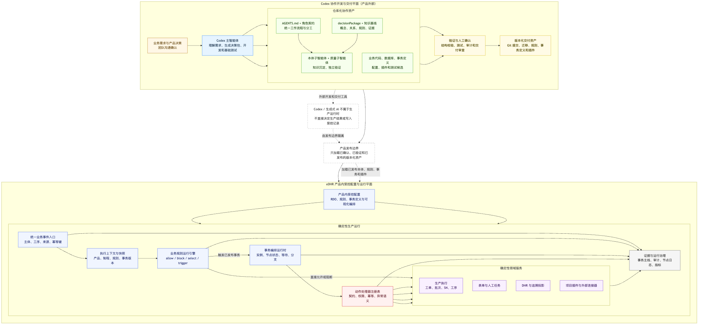

# Codex 协作交付与 eDHR 本体规则事务运行架构

## 1. 文档目的

本文定义 eDHR 面向项目交付和二次开发的目标架构。目标不是让每个客户项目复制并修改一套产品代码，也不是在产品内增加一个 AI 交付工作台，而是在稳定的标准产品内核上，通过业务本体、结构化规则、可视化事务编排、标准动作和项目插件完成受控定制。团队使用 Codex 作为产品外部的开发与交付工具，并通过仓库化协作契约和知识资产保持不同开发者、不同 Codex 会话之间的理解和质量一致。

本文是目标架构设计，不代表当前产品已经具备全部运行能力。尚未实现的能力必须保持内部可见，不得进入客户功能说明或生产运行投影。

## 2. 产品方向与核心判断

eDHR 的目标形态是“标准产品内核 + 项目交付包”，而不是无限制的低代码平台或按项目分叉的定制软件。

```text
标准产品内核
  + 项目级本体与规则扩展
  + 项目级事务流程
  + 项目级表单、模板和主数据配置
  + 必要的项目动作插件与外部连接器
  = 一个可独立版本化、测试、发布和升级的客户交付版本
```

业务差异优先按以下顺序实现：

1. **配置化**：表单、模板、工艺路线、制程、适用范围、参数和简单条件。
2. **编排化**：跨步骤、需等待、需人工处理或有条件分支的业务事务。
3. **插件化**：标准动作无法覆盖的确定性业务动作、设备协议和外部系统集成。
4. **修改内核**：仅当能力具有标准产品价值且无法通过稳定扩展点表达时采用。

“大多数常规需求通过配置和编排完成，少数特殊需求通过 Codex 辅助生成插件完成”是架构目标，不是固定比例或对客户的能力承诺。

Codex 不属于 eDHR 运行时，也不是交付后部署给客户的产品功能。Codex 通过 `AGENTS.md`、角色契约、结构化知识基线、已确认的 `decisionPackage` 和质量门禁参与开发与交付；这些资产通过 Git 在团队成员之间共享。

## 3. 架构原则

### 3.1 本体、规则、编排和执行各司其职

| 层次 | 回答的问题 | 主要产物 | 是否直接产生业务副作用 |
| --- | --- | --- | --- |
| 业务本体与事实 | 有哪些对象、关系和当前配置 | 概念、关系、版本、业务事实投影 | 否 |
| 业务规则 | 何时允许、阻断、选择或触发 | 事件、条件、结果和解释 | 否 |
| 事务编排 | 接下来执行哪一步、等待谁、如何分支和结束 | 事务定义、版本、实例和节点状态 | 只负责调度 |
| 动作处理器 | 如何可靠地执行一个具体动作 | 标准动作、项目插件、外部连接器 | 是 |

规则运行引擎负责确定性判断，事务编排器负责有状态的流程推进，动作处理器负责数据库、表单、生产状态、审计和外部系统等副作用。三者不得合并为可以执行任意脚本的无边界运行环境。

### 3.2 Codex 参与交付，不直接控制生产

Codex 可以根据已确认需求生成或修改以下候选资产：

- 本体概念、关系和业务解释；
- 结构化规则和事务流程草稿；
- 表单、模板和配置；
- 项目插件、迁移和连接器；
- 单元测试、集成测试、场景测试和交付文档。

候选资产必须经过结构校验、依赖分析、测试和人工确认后发布。生产运行时只能读取已发布、版本化且具备执行契约的资产，不允许 Codex 或其他生成式 AI 在运行中临时决定是否放行、改变生产状态或直接写入受控记录。

### 3.3 生产对象冻结执行依据

工单、批次或 SN 开始执行时，应保存适用的产品、产品簇、制程版本、路线、DHR、表单、文档、规则集和事务定义版本引用，并形成执行快照。后续发布新规则或事务版本只能影响新创建的生产对象，不得静默改变正在执行或已经完成的历史对象。

### 3.4 所有扩展都必须可解释、可测试、可审计

每项运行决策至少应能追溯到：

- 业务事件和主体；
- 使用的知识模型、规则集和事务版本；
- 命中的规则及其输入事实；
- 执行的动作处理器及参数摘要；
- 操作者、时间、结果和审计事件；
- 适用的生产执行快照。

## 4. 总体架构图



Mermaid 源文件：[ai-enabled-custom-delivery-and-transaction-runtime.mmd](ai-enabled-custom-delivery-and-transaction-runtime.mmd)。

架构分为两个明确隔离的平面：

- **Codex 协作交付平面（产品外部）**：团队在这里沟通需求，主 Codex 智能体生成决策包并开发，本体和质量专业智能体维护知识与验证结果，最终形成版本化交付资产。
- **eDHR 产品配置与运行平面（产品内部）**：产品提供 RDO、规则、事务定义和可视化编排等受控业务能力；生产系统通过规则引擎、事务编排器和已注册处理器执行，不直接调用生成式 AI 作出生产决策。

## 5. 核心组件职责

### 5.1 Codex 协作开发与交付流程（产品外部）

Codex 协作流程不属于 eDHR 的产品页面或运行服务。它由团队在各自的 Codex 会话中执行，仓库中的契约和知识资产保证不同开发者使用相同的协作方式。主 Codex 智能体负责：

1. 从正常业务沟通中提取已确认概念、关系、规则、事件和动作，形成 `decisionPackage`；
2. 读取仓库中的知识基线、历史决策、证据和角色契约，避免每个 Codex 会话重新理解项目；
3. 连续完成业务代码、页面、数据库、接口、事务定义和基础测试；
4. 将已确认决策并行交给本体建模智能体沉淀，将收尾范围交给质量验证智能体独立检查；
5. 对真实业务歧义向产品负责人提问，不让 Codex 自行补全关键规则。

这些协作结果进入 Git 的代码、文档、知识资产、测试和交付记录，不需要在产品内另建一个 AI 工作台页面。Codex 生成的候选内容仍然不能绕过代码审查、知识门禁、测试和人工发布确认。

### 5.2 业务知识与规则中心

业务知识与规则中心维护：

- 领域词典和概念本体；
- 业务对象关系和适用范围；
- 结构化业务规则；
- 规则状态、版本、证据和解释模板；
- 动作执行契约和处理器标识；
- 客户可见、内部可见和运行时可见投影。

本体回答“是什么”，规则回答“何时成立”。规则运行时只能读取已发布且满足运行投影条件的规则。

### 5.3 可视化事务编排器

可视化事务编排器是 eDHR 产品内的业务配置能力，用于定义项目自定义事务。它不是 AI 交付工作台，也不是任意脚本编辑器，而是受控节点和执行契约的图形化作者工具；Codex 可以在交付过程中生成事务草稿或配置变更，供人员在产品内确认。

第一阶段建议支持：

- 开始和结束节点；
- 表单节点；
- 人工任务节点；
- 条件判断和互斥分支；
- 标准动作节点；
- 项目插件动作节点；
- 手工触发和有限的工序事件触发；
- 事务适用范围；
- 草稿、校验、测试、发布、停用和版本审计。

第一阶段的发布校验至少覆盖：

- 开始和结束节点完整；
- 不存在不可达节点和无出口路径；
- 条件分支具有明确语义；
- 引用的表单、规则、动作和适用对象存在；
- 动作参数符合执行契约；
- 所有生产副作用均由已注册处理器承载；
- 流程版本可以形成不可变发布快照。

复杂并行、嵌套子事务、补偿编排、跨系统长事务、库存联动和复杂消息策略可在后续按真实项目需要扩展。底层定义需要保留版本和节点类型扩展能力，但第一阶段不提前实现未验证节点。

### 5.4 规则运行引擎

规则运行引擎接收业务事件、运行上下文和版本化事实，返回结构化决策，例如：

- `allow`：允许动作继续；
- `block`：阻断并返回稳定原因码和解释；
- `select`：从受控候选中选择适用配置；
- `trigger`：触发某个已发布事务定义；
- `require`：要求满足某项证据或人工任务。

规则引擎不直接更新业务表。其输出必须包含命中规则、规则版本和解释数据，供编排器、业务服务、审计和问答使用。

### 5.5 事务运行时

事务运行时负责：

- 根据事件和适用规则启动事务实例；
- 保存事务定义版本、业务主体和执行快照引用；
- 管理当前节点、等待状态、重试、完成、关闭和中止；
- 推进表单、人工任务、条件和动作节点；
- 使用幂等键避免重复触发；
- 记录节点日志、事务主线和审计事件。

事务实例使用创建时冻结的事务版本。发布新版本不能改变存量实例的节点图和执行语义。

### 5.6 动作处理器与项目插件

动作处理器是事务节点和规则结果可以调用的确定性能力。每个处理器必须具有稳定标识、参数契约、权限要求、幂等策略、审计语义、异常语义和测试证据。

动作分为：

- **标准动作**：创建表单实例、完成工序、创建人工任务、写入标准审计、发送受控通知等平台能力；
- **领域动作**：检验、返工、不良、拆分、物料或标签等随业务模块逐步实现的能力；
- **项目插件**：客户专属设备、ERP、算法或特殊业务动作；
- **外部连接器**：通过明确协议调用外部系统，并处理超时、重试和结果映射。

流程定义不得直接包含 SQL、任意脚本或未注册 HTTP 调用。特殊能力必须通过受控插件接口进入，避免项目定制绕过权限、审计和升级边界。

### 5.7 交付包、验证与发布

一个项目交付包应包含适用的版本化交付资产。它是 Codex 交付产生的仓库和发布资产，不是要求客户在产品内维护的 AI 工作台数据：

```text
manifest
ontology-delta
rule-set
transaction-definitions
forms-and-rdo-config
plugin-artifacts
database-migrations
automated-tests
release-notes
compatibility-metadata
```

发布流水线至少执行结构校验、引用完整性、规则和流程静态校验、迁移检查、自动化测试、权限与审计检查、兼容性检查。通过后生成不可变版本；运行环境按租户、项目和产品版本读取被批准的交付包。

## 6. 三类定制路径

| 客户需求 | 首选方式 | 示例 |
| --- | --- | --- |
| 改变字段、表单、文档、适用范围和简单条件 | 配置和规则 | 某产品装配工序增加检验表单 |
| 增加等待、人工处理、条件分支和跨步骤闭环 | 事务编排 | 检验不合格进入返工，返工后重新检验 |
| 新增平台不存在的确定性动作或外部集成 | 项目插件 | 调用客户设备获取检测结果并映射状态 |

Codex 在三条路径中都可以辅助生成，但交付人员必须能够从代码/配置差异、规则解释、流程图和自动化测试中确认其业务含义。

## 7. 示例：Codex 辅助创建自定义检验事务

客户需求：

> 装配工序完工后填写检验表单，主管确认后才能继续；不合格时创建返工任务，返工完成后重新检验。

设计与发布过程：

```text
Codex 提取：装配工序、检验表单、主管任务、合格条件、返工动作
  -> 生成本体和规则影响分析
  -> 生成事务流程草稿
  -> 人员在可视化编排器中确认节点、条件和适用范围
  -> 校验动作契约和流程完整性
  -> 生成正向、负向、重复触发和版本兼容测试
  -> 发布事务版本
```

生产运行过程：

```text
装配完工事件
  -> 规则引擎匹配已发布事务版本
  -> 创建事务实例并冻结版本引用
  -> 表单节点创建检验表单
  -> 人工任务等待主管确认
  -> 条件节点读取结构化检验结论
      -> 合格：事务完成并允许后续生产
      -> 不合格：调用已注册返工处理器
  -> 返工完成事件恢复原事务或启动受控后续事务
  -> 写入事务主线、审计和 DHR 候选证据
```

这里 Codex 不参与生产时的合格判断；合格条件、数据来源、事务版本和处理器都是发布前已确认的确定性资产。

## 8. 面向 Codex 协作的交付体验

你们不需要把这套能力做成产品内的 AI 工作台。为了让非程序员也能借助 Codex 参与常规项目交付，仓库协作流程应提供：

- 统一的 `AGENTS.md`、角色契约和三级执行节奏；
- 统一的知识基线、业务决策、证据和开放问题文件；
- 主 Codex 智能体自动生成 `decisionPackage`，不要求用户手工填写知识 YAML；
- 本体建模和质量验证智能体的固定职责、交接格式和关闭规则；
- 代码、配置、事务定义和知识变更的可读差异；
- 规则解释、流程图、测试场景和发布影响分析；
- 发布影响分析和恢复上一已发布版本供未来对象使用的能力；恢复操作必须形成新发布记录，不得改写存量实例和历史快照；
- 无法通过配置完成时，明确提示需要生成项目插件，而不是静默生成不可见代码。

非程序员可以负责业务表达、流程确认和场景验收；Codex 可以承担大量结构化配置、代码生成和测试生成；高风险插件、迁移、权限和生产状态变更仍需具备工程能力的人员审查。

## 9. 第一阶段交付范围

第一阶段应交付一条完整但受控的垂直链路：

1. 建立事务定义、版本、节点、边、适用范围和触发配置模型；
2. 建立最小可用可视化事务编排器；
3. 建立规则判断、事务实例和节点状态运行内核；
4. 支持表单、人工任务、条件和注册动作节点；
5. 建立标准动作注册和项目插件接口；
6. 建立草稿校验、模拟测试、人工确认和版本发布；
7. 在批次/SN工序工作台提供事务处理入口；
8. 冻结事务、规则和相关 RDO 版本引用；
9. 写入事务主线、节点日志、审计和 DHR 候选证据；
10. 让 Codex 能根据 `decisionPackage` 生成事务草稿、测试场景和项目插件骨架。

第一阶段不要求覆盖所有制造场景，也不要求实现完整 BPMN。验收重点是：一个真实的项目差异可以从自然语言需求开始，经 Codex 生成候选资产、在产品内可视化确认、发布、运行和追溯形成闭环。

## 10. 暂缓范围

下列能力在详细业务规则和执行契约确认前保持规划状态：

- 任意脚本节点和直接数据库操作；
- 无限制的复杂并行和循环；
- 跨系统分布式事务和自动补偿；
- 通用返工、不良、报废、拆分、库存和检验动作全集；
- 客户在生产环境中自由修改本体或已发布规则；
- 生成式 AI 在生产运行时自主选择流程或改变受控记录；
- 无人工确认的 AI 自动发布。

### 10.1 与早期 P0/P1 建议的关系

早期冠骋调研曾建议生产 P0 只预留事务上下文、到 P1 再实现最小事务闭环。当前产品决策已经调整：为了支撑 Codex 辅助的定制交付，**第一阶段即纳入最小可用的可视化自定义事务编排、事务运行时和动作扩展接口**。这项调整取代早期文档中的阶段划分建议，但不改变“暂不复制冠骋全部复杂节点”的范围控制。

旧调研中的 P0/P1/P2 标签仍可用于理解能力复杂度，不再作为本架构的实施顺序依据。后续生产模块拆解应以本文第一阶段范围和经确认的具体业务闭环为准。

## 11. 架构验收标准

后续实现应至少满足以下架构级场景：

1. Codex 生成的事务草稿在发布前不能创建生产事务实例。
2. 已发布事务版本可以在适用事件发生时创建实例，并按节点推进。
3. 动作节点只能调用注册且契约匹配的处理器。
4. 重复业务事件不会重复创建事务、表单或业务结果。
5. 事务新版本发布后，存量实例继续使用原版本。
6. 每次规则决策和动作执行都能查询命中规则、版本、输入摘要、处理器和审计结果。
7. 项目插件升级失败不能破坏标准产品内核或其他租户交付包。
8. 删除或停用规则、流程、表单和插件前能够查询依赖和历史引用。
9. 客户问答只解释当前已发布能力，不泄露内部规划和未发布项目草稿。
10. 团队成员可以借助 Codex、可视化事务流程和模拟数据完成常规流程确认，但高风险变更仍有明确审查门禁。

## 12. 与现有架构的关系

- 本体状态、投影和执行契约原则沿用[业务知识本体模型](business-knowledge-model.md)。
- 事务、投影、追溯和 DHR 证据边界沿用[事务、投影、追溯与 DHR 汇总业务边界](transaction-traceability-dhr-business-rules.md)。
- RDO 具体版本引用和生产快照原则沿用[RDO 版本治理与后续演进](rdo-version-governance.md)。
- 技术栈和 AI 协作边界沿用[技术栈与 AI 协作开发策略](technology-stack-and-ai-development.md)。
- 冠骋事务能力仅作为业务参考，详见[冠骋事务模块调研](../reference-assets/research/crown-transaction-module-research.md)；本产品不复制其低代码平台实现。
