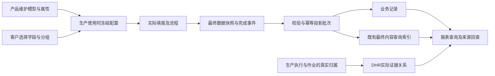

# 电子表单追溯与业务投影落地方案

更新时间：2026-10-07（侧边讨论确认补录，见2.5节）。知识基线仍为0.3.24。下文既有源码核对基点与验证记录保留其原时点；本次仅同步产品确认，不修改代码、数据库或运行配置，不新增运行验收结论。

同日主会话已依据追加授权进入明确范围的目录实现，见[追溯项目录切片记录](../development/form-lookup-catalog-2026-10-07.md)。上句“仅同步”指侧边补录时点；新增目录、候选与已有完成查询的验证以该记录为准，不扩大为引用混合检索、在制索引或完整MVP已完成。用户追加统一产品术语“追溯项”（历史“查找项”同义）并遵循统一页面UI/UE；稳定标识和历史证据保留。

**文档状态：开发实施中。**2026-09-29 已按用户要求在当前目录创建 `form-traceability-projection` 分支，独立空库 `edhr_form_projection` 已迁移启动。下文原方案中的阶段0说明保留为规划历史；实际实现与验证以第18节为准，不表示全部矩阵或客户试用已经完成。

本文件独立承载电子表单追溯与业务投影的产品设计、工程方案、实施顺序和验收范围。跨模块规则继续以[作业、投影、追溯与 DHR 汇总业务边界](transaction-traceability-dhr-business-rules.md)及对应知识决策为依据。作业状态机、生产执行、DHR 汇总审批的完整设计不在本文重复维护。

朋友及业务评审读者可先阅读[方案简版](form-traceability-projection-brief.md)。本文作为开发接手的主设计稿；简版是面向读者的摘要，不能将其中省略的条件视为取消。原开发会话先读[2026-10-03交接入口](../development/form-traceability-projection-handoff-2026-10-03.md)，再按第17节核对实际文件。

## 1. 阅读方式与方案摘要

| 标识 | 含义 |
| --- | --- |
| C：用户已确认 | 来自当前讨论的明确要求，可以进入本次知识决策 |
| B：既有设计边界 | 已存在的业务契约；其成熟度仍以知识基线为准 |
| P：候选实现 | 为实现目标提出的交互、数据或工程方案，尚未作为已实现能力 |
| Q：待确认口径 | 会影响相应功能结果的问题；实现依赖部分前必须解决 |

产品目标是让客户保留熟悉的普通表单字段，在需要时选择数据来源，让系统能够按批次、SN、设备或其他信息查到记录，并生成报工、报废、消耗等报表所需数据。

方案概括为：**业务统计由产品方预置模型，客户选择来源；查找与追溯允许客户在产品支持的类型内维护可复用查找项，再关联字段来源。统一取值与来源定位，预设报表复用结果。**目录和运行契约的具体实现仍为候选方案。

- 字段类型决定怎样填写，例如文本、数字、单选、引用、子表。
- 业务属性决定这个值在已支持模型中的含义，例如报废记录的分类。
- 投影配置说明从哪些字段或业务上下文取值，以及怎样保持明细对应关系。
- 报表定义查询、展示与分组，不另建一套字段含义。
- 按内容查找表单，与生成实际消耗、报废等业务记录具有不同的信息要求。

## 2. 已确认要求与本期边界

### 2.1 C：用户已确认

1. 查询动作发生在报表菜单；表单设计器负责配置可用的数据来源。
2. 用途配置决定是否形成表单内容追溯或业务统计投影；未配置用途不强制生成投影。无论是否配置，表单仍沿实际生产关系关联，DHR 证据仍按真实关联独立归集。
3. 统计模型由产品方事先定义与维护，客户只选择字段、配置取值关系、核对结果。不得把建立统计模型或编写投影代码交给客户。
4. 已有产出汇总与固定用途代码属于试验实现，可以按更合理的统一方案替换。避免多个模块各自维护字段用途、取值规则与统计口径。
5. 新增展示、筛选和分组维度是需要考虑的扩展需求；“报废后自动扣库存”等新业务动作另走业务需求，不纳入本次。
6. 低配置复杂度、低学习成本和便于实施培训是核心验收目标；不能凭原型或点击次数直接宣称已经达到。
7. 开发前先完成独立方案文档，原跨模块文档仅作相关修正。用户倾向在当前项目目录使用可推送到 GitHub 的功能分支，供朋友拉取评审。
8. 用途按字段配置；只有在正式生效时才形成对应投影。未配置或尚无有效采集值时，不得把“没有数据”解释为实际数量为零。
9. 批次最终产出取配置为最终产出的工序正式报工数量，工单产出汇总其所属批次；不跨工序相加。报工字段须表达约定的产出语义，但不强制绑定某个固定字段名或良品数量字段。
10. 不良与报废按各自配置独立统计，不自动加减批次最终产出；计算最终产出不要求另外存在质量表单。同一表单可配置多种用途，相关指标可在同一报表展示。质量比率、对账、倒扣等属于另行确认的需求。
11. 2026-10-03确认：画布上直接点选字段或子表是主要配置入口，集中配置是熟练后的总览与调整入口；页面必须有主次并渐进展示，降低学习门槛。此前集中配置优先的建议已被此要求替代。
12. 2026-10-03确认：未来新增业务用途允许二次开发，目标是开发成本低、容易维护；不要求全业务零代码，也不为此提前建设庞大的通用规则引擎。
13. 2026-10-03确认：认可不同表单提供不同指标、汇总到同一报表行的方向，但必须明确统计对象、范围和每项来源。不能由此推断已经支持任意跨表单事件关联。
14. 2026-10-03追加确认：表单可完全不用于业务报表，仅将批次号、设备号、工序等字段配置为查找与追溯用途，按信息查找相关记录。画布优先交互覆盖“用于查找与追溯”和“用于业务统计”两个并列、可独立选择的任务；允许仅前者、仅后者、两者都配或都不配，前者不能藏成统计的高级附属项。用户所说“所有相关的报表”保留其查找意图，返回原始表单记录/证据与提供业务报表入口分别解释，具体结果页面仍待设计，查找范围遵守既有权限。
15. 2026-10-03继续确认：竞品源码和产品可作参考对照，不照搬其交互；本产品保持低学习成本画布配置及低成本二开维护目标。统计事实必须携带用途定义的明确业务归属/粒度（如批次、工序），归属不依赖用户手填同名字段或配置追溯用途。部分表单字段应可配置从生产上下文自动带入以减少手工填写；同一字段在语义兼容时可同时自动带入并用于检索/统计，不另造重复配置。自动带入的具体交互与生命周期未定。

16. 2026-10-03继续确认：子表是常见组件及投影交互设计重点，首期同时覆盖子表和多个分散主表字段组成一条业务明细的场景。子表优先不表示首期只交付子表，也不能据此把主表字段配对延后；具体交互及其余能力的分期仍待定。见`DEC-0075-19`。

17. 2026-10-05确认：MVP包含可复用的查找项目录。管理员在产品支持的取值类型内定义查找项，常用项由产品预置；制表人员将普通字段或子表列关联到查找项；查询人员在追溯页面输入查询值，查看有权限的来源表单和命中位置。不同表单、不同字段名称可关联同一查找项，查询含义的定义与实际输入的查询值分开。见`DEC-0075-20`。
18. 2026-10-05确认：客户自定义业务统计报表进入二期；MVP业务统计保持预设报表展示，并为二期保留扩展空间。该分期不取消两类用途独立可选、两类来源形态、来源配置及统计/快照约束，也不确认客户自由创建统计模型、公式或任意跨表关联。见`DEC-0075-21`。

### 2.2 B：沿用既有业务边界

- 模板提供稳定字段及分组身份、受控版本、表单实例、最终数据快照及语义绑定；作业与投影模块解释契约。
- 非流程表单提交即完成时发布最终投影；流程表单在最终结束后使用最终值。暂存、首次提交、退回和再提交不产生正式统计结果。
- 重复事件必须幂等，变更与作废须保留历史并支持解释失效或冲销。
- DHR 由生产执行、作业等真实关系形成并持续归集。表单投影不创建 DHR，也不以批号文字相同决定归属；DHR 证据可见性与最终业务投影分别治理。
- 模板字段权限、业务来源授权、签名、生产快照和 DHR 冻结版本继续使用既有契约。

### 2.3 P：首轮开发目标与明确暂缓

首轮建议打通“普通字段建表—配置取值—使用时快照—真实填报完成—投影—报表查询—来源回查”，以表单追溯、报工记录、报废记录、物料消耗及其必要批次关联为核心。

原始需求中的“不良原因及数量统计”也要保留目标位置：作为报工相关的不良明细模型规划；没有原因分项数量时只能展示现有信息，不能自动拆分总数量。其数量口径见 Q4。

灭菌、检验、放行任务的完整事件追溯，长期记录本的独立生命周期，以及复杂成品组件谱系，需要对应来源模块或额外契约。它们列入完整规划及依赖表，不能用本轮表单配置界面代替实现。AI 辅助作为可选增量；人工配置闭环不依赖 AI。

### 2.4 C：MVP与二期分工（2026-10-05）

| 阶段 | 已确认范围 | 尚需收敛的实现契约 |
| --- | --- | --- |
| MVP查找与追溯 | 管理查找项目录 → 普通字段/子表列关联 → 生成查询条件 → 授权来源与命中位置回查；新增项进入两处候选，不以已有匹配数据为前提 | 支持类型及操作符、查找项生命周期、多条件匹配范围及原有能力保留；新含义对未关联旧实例的补充覆盖已排二期，见2.5节；独立索引时机Q15与结果组织Q16其余部分仍待定 |
| MVP业务统计 | 保留预设业务模型及预设报表展示，客户配置来源并预览；子表和分散主表字段均覆盖 | 对应行身份、表头共享及未明确统计口径按原Q项处理 |
| 二期自定义报表 | 自定义业务报表留到二期，当前保留可扩展边界 | 指标/维度选择、布局、分享权限和具体开放范围尚未定版；不等于客户自建业务模型Q13已确认 |

建议二期的报表定义复用MVP的属性身份、正式事实及来源定位，不把来源绑定写死在某一张报表内；具体接口与存储在实现时决定。保留扩展空间不要求MVP提前建设自定义报表编辑器、自由公式或通用跨表查询引擎。用户参考图确认的是目录到查询的产品路径，不把图中技术建议或待定项自动提升为运行规则。

### 2.5 C：侧边讨论确认增量（2026-10-07，供主开发会话接手）

证据类别为 `user-confirmed`：用户针对最终设计评审的侧边讨论明确了以下三项，并要求反哺已有设计文档。只记录产品要求，不表示已实现；本次不修改知识基线或分配新的DEC编号，主会话继续在同一决策包内同步本体和独立质量门禁。

1. **用途驱动的文本身份匹配与次要展示。** 用户明确：只有字段已勾选追溯或统计用途、且该用途表示物料时，才触发相应匹配；匹配后信息应次要展示，优先考虑hover，避免挡住其他单元格。此处约束普通文本的用途驱动解析，不凭字段名字或“像物料号”的内容猜测身份；仅声明供应商编号等文本查找含义不自动解析为系统物料。既有原生引用字段仍按自身引用配置查询、选取和校验，不要求另勾投影用途（沿用DEC-0060）。**交互建议**为单元格内轻量状态标记，悬停／聚焦／点击查看名称及规格，不常驻展开或撑大行高；影响正式统计的异常按既有校验规则明确定位，不能只藏在hover。唯一匹配不证明填报人没有输成另一条有效编号。
2. **同一查找项自动进入两处候选。** 用户明确：“管理员定义新的追溯查询项之后，追溯页面的条件里就可以选择到这个查询项”。管理员新增可用项后，表单设计的追溯用途候选及追溯页条件候选均从同一目录获得该项；设计侧按字段类型／语义兼容性筛选，查询侧遵守权限。无需再单独维护一份页面条件，也不要求先有模板绑定、实例或索引命中才出现。制表人员仍需明确关联来源字段；查询人员选择该条件后输入实际查询值。常用条件常驻、其他条件按需添加属于展示建议。
3. **未关联新含义的历史实例补充覆盖排二期。** 用户明确：旧实例没有该字段含义时，通过新项查不到旧表是合理的，相关兼容首期不做，列入下一期TODO。旧实例可能已有同名字段或同样的值，但其快照未关联新含义就不能自动认定为命中；新增配置供后续采用该配置的新实例使用。MVP不做为新含义回填旧绑定、补索引或重新解释旧实例。原有已配置实例的查询、快照、审计及DHR证据继续保留；本延期不授权删除旧数据，也不取消已有含义下的查询能力。建议查询页提示“仅查询已配置此查找项的记录”。

**仍待定：** 编号唯一范围、改号／重用、零或多匹配处理，以及自由文本实体解析是否纳入MVP（Q6）未被本次条件性讨论全部确认；Q9表头共享、Q15可查状态、Q17上下文带入生命周期也不因此关闭。身份解析的触发条件不等于授权查询命中自动生成物料使用关系。原有目录自身的生命周期和已配置数据保留策略仍需设计，不能将“新含义历史补充覆盖延期”扩大为忽略所有历史读取。

**增量验收期望（尚未运行）：** 未配置物料含义的普通文本不触发物料解析；匹配信息不常驻遮挡相邻单元格；新增“灭菌锅次”后无数据也能在两处兼容候选中选到；旧快照未关联该项则不被该项查询命中，而原有查询能力不退化。本次仅文档补录与静态检查，适用本体／独立质量复核由主开发会话继续，不复用早先评审的通过结果覆盖本增量。

## 3. 当前能力与原始证据

### 3.1 原始源码核对（original-evidence）

| 源码 | 当前可确认能力 | 对本方案的意义 |
| --- | --- | --- |
| [字段模型](../../gmp-platform/frontend/src/pages/master-data/template-designer-react/types/model.ts) | 普通字段有稳定 id、类型及 typeConfig | 复用字段身份，业务含义不必增加控件类型 |
| [设计器外壳](../../gmp-platform/frontend/src/pages/master-data/template-designer-react/TemplateDesignerReactShell.tsx)与[画布面板](../../gmp-platform/frontend/src/pages/master-data/template-designer-react/tabs/canvas/CanvasTab.tsx) | 字段设计、表单设计、流程设计及字段配置面板 | 可承载统一配置入口，不需要重做表单画布 |
| [现有用途选项](../../gmp-platform/frontend/src/pages/master-data/template-designer-react/utils/fieldBusinessPurpose.ts)与[产出汇总](../../gmp-platform/backend/src/main/java/com/zencas/edhr/production/service/ExecutionOutputSummary.java) | 三类固定用途；按当前表单已保存数量汇总 | 是待收敛的试验机制，不是新模型必须保留的约束；也不能当成最终统计引擎 |
| [实例查询](../../gmp-platform/backend/src/main/java/com/zencas/edhr/production/service/FormInstanceQueryService.java) | 元数据查询、生产来源授权、实例详情 | 复用身份和授权；尚不等于任意内容查询已实现 |
| [执行快照](../../gmp-platform/backend/src/main/java/com/zencas/edhr/production/service/ExecutionSnapshotBuilder.java)与[实例记录](../../gmp-platform/backend/src/main/java/com/zencas/edhr/production/service/FormInstanceRecordService.java) | 已有冻结上下文及实例记录集成点 | 新投影应接入既有生命周期，不再创建第二套表单实例 |

本次只读核对没有执行这些运行模块的全套回归，不能据表中源码推断发布验证已经完成。

### 3.2 客户原表核对（original-evidence）

资料根目录为本机 `安速康表单`；以下文件名和单元格区域可用于定位原件。原件与真实生产数据不随功能分支上传；演示使用经整理的模板结构及虚构填写值。

| 原表与区域 | 已观察结构 | 配置应表达的内容 | 不可自行推断 |
| --- | --- | --- | --- |
| `安速康生产/刀头/CX11-ZYJ11-06-JL01 刀头生产及检验记录-末道清洁 A0.xlsx`，Sheet1 A3:J16 | 酒精批号、合格/不合格数量、无尘布更换数、签名、NCR编号 | 批号查表、数量来源候选、单据关联 | 酒精没有用量；更换数不自动等于消耗数；合格数是否正式报工需确认 |
| `XD生产批记录/XD_CX11-ZYJ01-08-JL01 手柄右壳组件生产检验记录 A8.xlsx`，Sheet1 A4:AB29 | 横向物料/批号/数量，后续成品SN与组件编号 | 按列保留物料组；成品与组件按实际组建立关系 | 不能将所有批号、SN做任意两两组合；数量是否实际消耗及单位需确认 |
| `安速康生产/报废处理单.xlsx`，Sheet1 A5:I10 | 物料、批号、一个数量栏、申请、批准、实际处理及照片 | 报废数据来源与阶段 | 一个数量栏不能证明各阶段处置量相同 |
| `安速康生产/刀头/CX11-ZYJ11-05-JL01 刀头生产及检验记录（组装） A5.xlsx`，Sheet1 A8:I85 | 多个环节重复出现合格/不合格数 | 选择正式结果区域，其他区域保留检验过程意义 | 不把各环节简单累加 |
| `ASK过程检验记录/CX20-JL01 不合格品处理单 A6.xlsx`，Sheet1 A4:J13 | 总不合格数、自由描述、多个类别 | 类别查询与现有总数展示 | 无原因分项数量时不能生成各原因不良数量 |
| `XD 机加工批记录/XD_CX11-ZYJ14-JL01 磨料使用记录 A2.xlsx`，Sheet1 A3:G5及明细 | 每行有工单、零件、磨料、时长、签名 | 行级来源上下文、长期记录关联 | 不能假定整张记录本对应一个批次或一次最终完成 |
| `ASK过程检验记录/手柄及电源适配器DHR复核记录.xlsx`，Sheet1 A4:G16 | 复核记录 | 可只保留记录及既有归属 | 不因无统计字段拒绝使用或排除DHR证据 |

原型已验证部分交互，未验证所有表单完整还原、客户试用、真实投影或生产报表。此前资料扫描和原型说明属于 secondary-reference；本表中的结论以原始 Excel 结构复核为依据，不给出虚假的覆盖百分比。

### 3.3 冠骋参考范围

本机参考工程的 `EDHRFieldTypeEnum` 和 `OnlineFormDataCatchService` 显示，报工、报废、消耗按业务字段类型识别取值。`EdhrReverseTraceBs.java:68–101` 要求已有 DHR，按其主体查询主线表单并查目录，未命中目录时存在来源目录回退。这支持“已选 DHR 范围内找相关表单”的判断，不证明全局按任意批号反查 DHR，更不表示追溯配置会创建 DHR。

这些是 original-evidence；客户新增每一种追溯条件是否都要增加枚举，以及自定义模型是否以预留列实现，现有核对不足以确认。本文不以这些未经核实的假设决定架构。

## 4. 功能矩阵与来源分工（P）

| 报表 | 来源及复用方式 | 首轮目标 / 依赖 |
| --- | --- | --- |
| 生产追溯 | 生产/工序/作业真实事件＋表单实例与内容索引 | 接通表单证据回查；事件全集需单独验证 |
| 灭菌追溯 | 灭菌任务事件、作业、关联表单 | 统一数据契约预留接入点；任务模块不可由配置伪造 |
| 检验追溯 | 检验任务事件、过程记录、关联表单 | 同上，填写检验表不等于任务生命周期已经实现 |
| 放行追溯 | 放行任务、决策事件、关联表单 | 同上，不改变现有放行或签署边界 |
| 表单追溯 | 实例号/状态等元数据＋授权内容索引 | 首轮核心；查询结果打开准确的来源实例及修订 |
| DHR追溯 | DHR元数据＋实际关联实例＋内容索引 | 首轮复用既有归集关系；当前视图和冻结版本须区分 |
| 记录本追溯 | 记录本、条目及内容索引 | 待Q3，不能以一张生产表单代替完整记录本模型 |
| 批次追溯 | 生产上下文、明确的物料使用/设备/人员关系 | 首轮接通有证据的基本关系；复杂组件SN谱系另验收 |
| 报工记录 | 正式报工记录及对应数量、单位和来源 | 按工序/用途查看正式来源；不跨工序合并成批次最终产出 |
| 批次最终产出／工单产出 | 配置为最终产出的工序正式报工数量；工单汇总所属批次 | 业务口径已确认，批次/工单联动仍是后续开发；不由当前工序报表推算 |
| 报废记录 | 报废对象、数量、单位、原因/分类、来源 | 按独立用途和配置字段统计；不自动改算最终产出 |
| 消耗记录 | 实际消耗物料、批次、数量、单位、来源 | 首轮目标；不能从出现批号直接生成消耗事实 |

原需求中的不良原因统计作为报工相关明细保留，受 Q4 约束。统计扩展不授权库存扣减、自动放行或其他新业务动作。

## 5. 用户角色与配置交互（P）

### 5.1 所有权

产品团队定义标准业务模型、属性、校验、查询能力和扩展属性发布包。实施人员复用这些能力完成客户模板配置；客户制表人员可以调整合法来源并核对预览。现场填写人员继续填写普通字段。

查找与追溯的所有权按2026-10-05确认补充：客户管理员可维护运行用的查找项目录，产品维护可支持的类型和查询能力。制表人员关联来源，查询人员输入值及查看授权结果。这是查询配置，不是客户编辑研发知识本体或统计规则；运行中改名、改类型、停用与历史兼容的具体策略仍需设计。MVP统计报表由产品预设，自定义报表二期再提供。

现有首次完成切片没有向客户开放统计模型设计器、任意SQL、脚本或自由创建业务动作；客户自建业务模型的未来能力仍待定。若新增责任班组等属性，由我们通过受控目录提供；具体由产品版本携带还是项目配置包发布，在实现时按同一目录契约处理，不能分散成客户条件分支。

### 5.2 入口与完整路径

入口主次按第2.1节已确认要求执行；以下具体交互仍为P类建议，不能把未回复的建议当确认。保留“字段设计／表单设计／流程设计”结构，建议在表单设计中安排：

1. **画布主入口**：直接点选字段或整个子表，从当前选择发起用途配置；建议使用画布＋轻量侧栏，先选用途，再引导补齐描述同一业务记录的必要字段。
2. **集中总览／调整入口“追溯与统计”**：供熟练用户核对已配置用途、缺失信息和来源，再定位到画布调整；无需先把整张表归为某一种场景。
3. **可选AI候选入口**：生成同一配置的草稿，继续走相同校验和人工确认。

建议画布与集中入口编辑同一份配置并可互相定位，无入口专属副本；AI若接入也只生成同一配置的候选。建议将用途配置模式与布局编辑区分，避免点选来源时误改布局；模式切换、侧栏位置及具体操作仍待定。一个模板可没有用途、只有查表用途，或有多种用途。配置过消耗后，相同来源事实提供的查询关联直接复用；报表选择不会重复生成事实。

推荐路径：先建普通表单 → 按需添加用途 → 高亮来源与分组 → 补齐必要信息 → 预览 → 保存配置 → 生产实例使用时统一校验并形成执行快照。

画布点选后应让两项任务并列可选：**用于查找与追溯**，选择要检索的字段含义及来源；**用于业务统计**，按对应业务用途配置事实所需信息。可只配置任一任务、同时配置或都不配置；只查找不要求先补齐报工、报废、消耗的数量/单位等业务字段。具体侧栏和结果页面仍待设计，不能将“查找与追溯”放在统计的高级附属项里。

配置按场景逐步展开。现有字段侧栏先显示当前字段已有用途；新增时先区分“按内容查找表单”和“形成正式业务明细”，再展示字段类型可承担的模型及属性。后续建议围绕同一业务记录引导补齐字段，集中入口收起详细来源。现有子表配置要求选择每行记录键；稳定行身份的实现选择仍待定，不能把现有必填键方式写成用户已定版。具体选项顺序来自开发者试用反馈，尚无客户使用频率数据；应在客户制表人员试用中核验。

### 5.3 配置界面必须表达的内容

- 目标需要什么信息、当前从哪里取值，以及哪些已由生产上下文提供。
- 哪些字段属于同一条明细，是每行一条、每列一条，还是整表一条。
- “按批号找表”只建立查询条件；“实际消耗”需要对象、数量、单位及相应含义。
- 不完整配置可保存；启用的用途在生产实例使用时必须完整，否则阻止生成执行快照。停用用途也须在概览中可见，不能偷偷跳过。
- 缺失、类型错误、跨组错配、单位不明、重复映射和未定业务口径就地说明，不用技术堆栈信息替代提示。
- 删除字段、改变数据类型或拆分分组时，列出受影响用途；不能悄悄指向另一个同名字段。
- 不配置用途不阻止普通表单使用；其原有字段、流程和签署校验仍适用。

### 5.4 预览与减少重复劳动

预览采用与正式运行相同的取值、分组、验证和转换逻辑，只不保存业务结果。使用模拟填写值或按权读取的样例；明确无真实投影、DHR创建或统计累加。

展示“将产生几条记录、每条来自哪个区域、在哪些报表可用、点击后回到哪份表单”。一条消耗记录被多个视图读取时，应直观显示为同一条记录的不同查看方式。

2026-10-03建议：分别提供单条记录和子表逐行预览，逐条核对来源、配对和数量；这不是当前集中弹窗已具备多行模拟的声明。表头共享值是否可参与每行记录及其来源表达仍待定。

模板新版本继承仍有效的稳定字段配置；同客户相似模板可以复用我们提供的配置样例。仅同名不足以自动确认含义，系统建议始终可检查与纠正。

### 5.5 首期两种来源形态的交互建议（P）

首期同时覆盖子表和主表分散字段已确认；子表是交互设计重点。下面的具体操作是待评审建议，不决定行身份、表头共享或其他未定运行契约。

| 来源形态 | 建议操作 | 预览重点 |
| --- | --- | --- |
| 子表 | 画布点选子表，选择查找或业务用途；配置列含义，由子表行结构帮助配对，不要求逐行手工建记录组 | 各行分别展示来源与结果，多行不串配；稳定行身份仍见Q12 |
| 主表分散字段 | 从一个字段发起业务用途，按具体业务名称引导补齐同一明细的其他字段，必要时选择已有明细或另建一笔 | 展示这笔业务明细用了哪些字段；另一笔明细分别配对，不能凭位置或同名自动合并 |

例如子表的批号、实际用量和单位三列，建议配置一次列含义后逐行形成消耗明细；主表中相距较远的“批号一”“用量一”“单位”则明确组成第一笔消耗，“批号二”“用量二”“单位”组成另一笔。该例为交互预期，不意味着表头字段向子表行共享已经获准，也不凭批号文字形成正式实体关系。

两种形态使用同样的并列任务入口，按具体场景渐进展示。仅查找时配置字段信息类型和来源，不要求先建立业务明细或补齐数量；正式业务统计才引导所需字段配对。内部需要可解释的记录归属，界面建议用“这笔消耗／这笔报废”等业务名称表达，不要求客户先建立抽象数据对象或统计模型。减少配置操作不等于自动猜测业务语义；字段名只能帮助提出可核对的建议。

用户关于安速康表单子表常见性的反馈作为设计输入保留，未在本轮进行原始表单样本统计，不宣称实际比例或易用性已验证。首期范围Q14已明确两种来源形态，其余分期与阶段出口仍待定。

## 6. 统一配置与属性模型（P）

### 6.1 四类对象

| 对象 | 作用 | 稳定身份与版本 |
| --- | --- | --- |
| 模型定义 | 产品方维护报工、报废、消耗、不良明细等记录所需信息和校验 | modelId＋modelVersion |
| 属性定义 | 如报废分类、责任班组、客户处置编号；定义类型、字典/引用范围和允许用途 | attributeId＋definitionVersion |
| 模板投影配置 | 目标属性到来源的映射、记录分组、启用用途、校验及预览说明 | bindingId／recordGroupId，随生产使用时的表单配置进入执行快照 |
| 投影批次及结果 | 记录哪份最终数据、哪版规则形成了哪些事实和索引 | projectionBatchId、sourceRecordKey、来源修订 |

名称仅用于显示。不同业务中的“分类”不能仅因同名合并；同一“报废分类”被查询和统计使用时复用同一属性身份及字典，避免追溯分类与业务分类各造一份。

### 6.2 支持的取值来源

- 普通主表字段：稳定 fieldId。
- 明细字段：稳定分组/列字段身份＋行或列记录键，不使用可变的屏幕坐标作业务身份。
- 生产、工序、作业上下文：通过受控字段目录读取；没有上下文的入口须在模板绑定或使用时校验中明确条件，不伪造值。
- 受控常量及字典/主数据派生：只允许模型声明的简单取值，保留选择依据；不提供任意代码表达式。

字段被多处展示不意味着多份数据。重复引用同一来源值不能自动重复计数。跨明细区域取值应明确关联键，不能自动做笛卡尔积。

### 6.3 固定业务字段与扩展属性

核心业务身份、数量、单位、有效性、来源实例和修订采用明确契约；扩展属性承载新增展示、筛选与分组需求。

建议采用固定业务列＋有类型的JSONB扩展值＋版本化属性定义。查询属性通过受控目录生成条件，并根据实际负载建立索引。JSONB本身不提供类型、授权、报表能力或良好性能，这些必须由统一服务实现。

第一期扩展范围建议为单值文本、数字、日期、字典引用和已存在的主数据引用。多值分组、自由公式、任意嵌套模型和新的业务关系，不默认随新增属性开放。

不预留 `text_01`、`number_01` 等空列供不同含义反复占用。定义一经进入生产执行快照，身份不能复用给另一个含义；改名与语义变更分别处理。发生类型或语义变化时生成新定义并验证兼容，不静默改写历史。

查找用途的目标流程已确认：管理员定义查找项（如“灭菌锅次”） → 制表人员关联字段或子表列 → 追溯页面按项提供查询输入及命中来源。建议先支持文本精确查询和单选值，再扩展数字、日期范围；这仍是类型/操作符分期建议，不因参考图确认而定版。业务统计扩展继续由产品提供属性及合法值来源、客户关联来源；新增查找项不会自动成为所有业务指标的分组维度。MVP只展示预设业务报表，自定义指标/分组组合及报表创建留二期；已有列显隐、顺序及宽度偏好继续保留，它们不等于创建自定义业务报表。两类目录契约的复用不要求每个报表写一套客户专属抓取代码。

### 6.4 标准模型的最低信息

| 模型 | 必须能够解释的信息 | 限制 |
| --- | --- | --- |
| 查表索引 | 属性、原始值及类型、来源实例/修订/字段路径/明细位置 | 查到同一文本不证明两个业务对象相同 |
| 报工 | 生产主体、相关工序/作业、正式来源、数量种类、单位、发生依据 | 不加总重复工序、重复表单或检验环节；见Q2 |
| 报废 | 报废物料/对象、批次、数量、单位、统计阶段、原因/分类及来源 | 所属生产批次与报废物料批次分别表达；见Q1 |
| 消耗 | 生产主体、实际使用的物料及批次、数量、单位、来源 | 单有批号可以查表，缺少用量不能生成数量事实 |
| 不良明细 | 所属记录、原因/类别、数量、单位及计数口径 | 同一件可有多缺陷时不得把缺陷次数冒充不良品件数；见Q4 |

字典新增选项与新增属性不同。若报废分类可由报废原因的受控关系得到，可以派生并记录当时依据；不得每次查询时连接最新字典，导致历史分类无解释地漂移。

报废“申请量／批准量／实际处理量”表达数量含义，不自动改变既有最终完成投影时机。若需要审批过程中的阶段性正式记录，必须另行确认对应事件契约，不能由选择一个统计口径绕过最终完成边界。

### 6.5 用途扩展与跨表单指标（2026-10-03，P）

新增用途允许二开的目标已确认；建议公共部分负责来源配置、冻结、解释、投影及追溯基础流程，各用途独立实现业务语义。新增普通用途主要增加定义、业务代码和测试，尽量减少修改公共页面。用途针对业务事实定义，新报表优先复用已有事实，不为每张报表新造用途。该分工是建议，详细第一阶段范围仍待定，不以扩展目标提前建设全业务通用规则引擎。

跨表单指标建议先明确目标行的统计对象、范围、粒度、单位和各指标来源，各来源分别聚合到目标粒度后再合并指标，避免原始明细多对多连接放大数量。报表行可以保留独立来源：A的良品与B的不良并列展示不要求它们是同一次事件；同一次业务事件的跨表单关联方式仍待定，不从相同文本或共享报表行推定关联。原始记录、正式业务事实、报表汇总和证据追溯应分别解释，汇总不改写源记录或产生额外事实。

### 6.6 独立查找索引与业务事实投影（2026-10-03追加，P）

建议两类用途共享画布选字段、使用时配置快照及来源定位等基础设施：查找索引用于检索字段值并返回命中来源；业务投影形成含明确业务语义、粒度、数量及来源的事实记录。只配置前者无需形成后者。共享基础设施是实现建议，不表示两类用途必有相同生效时机，索引状态范围和更新时点见Q15。

检索命中不自动证明正式上下游谱系、设备使用关系或工序执行身份。字段填入的工序文字可成为检索信息，但不能覆盖实际执行上下文的工序身份；批次号、设备号、工序等不同类型即使字符串相同也不能无区分混查。每个命中保留字段来源、表单实例及必要的明细/快照位置。用户的“相关报表”可涉及原始表单记录/证据及业务报表入口，两者分别说明，不以命中索引自动创建业务报表明细；页面和导航方式见Q16。

### 6.7 统计归属、上下文字段带入与字段用途（2026-10-03继续补充）

三件事分别解释：**执行上下文确定事实归属**，各业务事实携带用途定义的对象、批次/工序等身份及粒度；**上下文带入表单字段**，以减少手工填写，是否形成原始证据按其生命周期契约决定；**字段用于检索或业务采集**，按所配置用途提取值。未配置检索用途、未额外手填同名批次/工序字段，不影响统计事实从执行上下文取得归属。

建议在画布点选字段后分别设置取值来源（手填、当前生产上下文等）和数据用途，二者正交；自动带入不作为第三种报表用途。语义兼容时同一字段同时带入并用于检索/统计，复用字段和来源配置。身份字段建议只读或明确受控修改；编辑显示值不能覆盖系统实际执行身份。准确带入时机（创建/打开/任务绑定）、是否持久化成原始证据、缺上下文处理、重开是否刷新、哪些字段可编辑/覆盖、多设备如何选择及是否唯一均见Q17，不在此默认。

设备上下文不得假设单工序只有一台设备；设备文字号不自动建立正式使用关系。竞品源码和产品只帮助对照目标与证据，交互仍由本产品设计；未复核的竞品产品UI不能写成已核实事实，现有历史对照继续按原证据类别引用。

## 7. 投影运行与数据一致性（P，遵守B类边界）

下图描述既有首次最终完成链路及最终内容索引；本轮独立查找需求的其他索引时机未在图中定版，见Q15。索引命中与正式业务关系分开解释。

### 7.1 版本与幂等

- 模板版本保持原有可编辑方式。生产对象首次执行时，将当时的表单字段、画布、来源映射与模型目录版本复制到不可变执行快照；后续挂接的表单在挂接时复制。启用映射在复制前校验，后续完成和报表只读取实例快照，不临时使用最新模板配置。
- 最终事件保留 `formInstanceId`、`finalRevision`、模板版本与hash、规则版本、最终值快照引用、上下文及审计引用。
- 沿用 `formInstanceId + finalRevision + projectionRuleVersion` 的批次幂等键；每条结果还需稳定 binding/recordGroup/rowKey，不能靠数组当前位置维持跨修订身份。
- 同一批次的重复触发、失败重试不能重复入账。多个表单描述同一事实属于业务重复，不能靠批次幂等键解决，见Q2。
- 同一来源修订换规则重建时，保留原批次与原因；新旧结果切换必须保持单一有效集合，避免两版同时参与统计。

### 7.2 持久化与失败恢复

候选实现采用持久化待处理事件及幂等消费者：完成状态与待处理事件在同一事务记录，投影结果、索引和批次成功状态在一个事务发布。执行失败保留可重试状态，不让部分记录成为有效统计。完成与投影延迟的边界已按第18节 Q5 确认。

最小状态可表达待处理、处理中、成功、失败、失效；具体枚举和数据库表名在实现设计中收敛。需要并发认领、失败原因、重试次数、最后执行时间及管理员重试入口。不可仅依赖内存监听器，导致服务重启丢失待投影事件。

报表应能区分“没有记录”“尚待投影”“投影失败”。查询成功与零结果不能掩盖处理异常。监控、重试及重建权限属于产品运维能力，客户制表人员无需理解事件系统。

### 7.3 变更、作废、历史与来源定位

受控表单变更产生新修订，作废/替代使相应当前有效结果失效或冲销，旧快照与审计保留。切换有效结果必须与规则定义一致，不能直接物理删除历史。记录控制集成未闭环时，不得宣称可进入正式生产使用。

每条业务记录保留来源实例、修订、模板版本、映射、明细位置与投影批次；点击历史记录应查看形成该记录的来源快照，不自动跳到已修改的最新值。

DHR当前证据查询与冻结版本查询明确区分，后者沿冻结成员及引用的数据版本解释。新增索引或规则重建不得改写已冻结DHR成员、内容和批准状态。

既有首次完成切片的最终内容索引按最终投影时机发布；当前`formTrace`也在来源`COMPLETED`后进入同一批次，查询只读`SUCCEEDED`结果，这是现有源码路径，本轮不改变该契约。未完成表单仍可作为DHR实际证据出现并从既有来源入口查阅，不表示已被最终内容索引覆盖。本轮独立追溯检索是否覆盖暂存、进行中、未完成或失效记录，何时更新及如何区分当前/历史视图，尚无明确独立确认，列为Q15；不能仅因业务统计首次最终完成生效就把同一时机自动套给独立查找索引。

## 8. 查询、关系与报表复用（P）

### 8.1 同一业务属性多处使用

报废记录的分类同时用于报废分组和来源表单查询时，保持同一属性与来源链，不建立“追溯报废分类”第二个定义。

一条“生产P消耗物料M的批次L、数量Q、来源F”的记录可以供消耗列表、批次追溯及按L查F读取；不因报表数量增加而多计消耗，也不自动生成报工或报废记录。

### 8.2 查询粒度与身份

- 同一明细上的“物料批次＋责任班组”等组合条件必须在同一条记录上成立，不能分别命中不同明细后拼成假结果。
- 多个匹配明细返回同一表单时，表单列表去重并展示命中位置；业务统计按事实粒度计数，不按联表展开行数计数。
- 明确区分设备使用人、填报人和签署人。输入相同姓名不能自动建立人员身份关系。
- 物料批次、生产批次、SN、设备和单据使用各自类型及身份范围。只有文字且尚未解析为业务身份时，可以作为文本查表，不能冒充已验证的实体关系。
- 相同批号跨物料或来源范围的唯一性、手输编号的解析与确认策略见Q6。
- 仅追溯用途也保留检索信息类型、字段来源和实例定位；同字符串不同类型不混查。命中字段内容不覆盖执行上下文，不自动形成谱系、设备使用或工序身份。
- 分组统计不混加不同单位；转换须有明确换算依据。没有结果时不自行用0替代未知或失败。

### 8.3 权限

模型目录中的“可查询”只声明支持能力。实际检索、聚合、结果数量、导出、来源快照与附件访问均须遵守来源及字段可见性；不能先聚合所有数据再仅隐藏详情。

复用现有实例与来源授权，不新建可绕过生产/DHR权限的万能查询接口。第一期继续沿当前租户契约，不因新增查询入口宣称多租户隔离已完成。

“所有相关”指在既有授权范围内按已配置检索类型和字段来源查找相关记录；不能解释为越权全局查询，也不能只隐藏来源详情而泄露无权记录的命中数量。

## 9. API及代码所有权规划（P）

接口名称为职责建议，不作为已发布契约：

| 接口职责 | 输入与输出要点 | 所有者 |
| --- | --- | --- |
| 读取可配置模型/属性 | 当前产品支持范围、类型、字典引用、所需上下文、可查询能力 | 投影模块 |
| 保存模板配置草稿 | 稳定字段和分组引用、版本并发控制；返回逐项错误 | 模板模块 |
| 校验/预览 | 与正式解释器一致；返回候选结果、来源位置、错误和影响报表，无业务写入 | 模板＋投影模块 |
| 使用时校验与快照 | 首次执行或后续挂接时校验启用映射，复制表单配置与目录版本；不新增模板专属发布动作 | 生产执行模块 |
| 接收最终完成及失效 | 既有运行引擎事件、最终修订、幂等与可靠投递 | 生产/作业＋投影模块 |
| 报表查询和来源回查 | 受控筛选、分页、单位与事实粒度、快照定位和权限 | 报表模块 |
| 投影状态/重试/重建 | 批次、原因、规则与快照、操作者、审计和授权 | 投影运维 |

前端集中实现模型目录、配置编辑器、来源选择、分组校验展示及预览结果，不让每个报表维护自己的字段映射组件。后端集中实现取值与校验、投影生命周期和来源身份；不同业务记录保留清晰模型，避免万能大表或全能脚本引擎。

扩展路径采用 `product-core + configuration`：标准业务能力由内核实现，差异在受控目录和模板配置中表达。当前范围不引入项目插件、库存动作、通用规则编辑器或图数据库。

## 10. 旧试验实现的收敛与历史处理（P/Q）

用户允许替换试验逻辑，但未授权删除历史业务证据。实施前清点 `businessPurpose` 使用位置、模板/生产快照、现有数量汇总消费者及数据。

1. 先建立统一配置与解释契约，再将设计器入口和相关读取迁移到同一来源。
2. 对旧三类数量用途，只能在含义与来源明确时提出转换候选；不能把已有已保存汇总自动认定为正式报工或报废。
3. 生产工作台如仍需要进行中数量，只能明确展示为过程参考值；是否保留及正式数如何呈现，见Q7。不能把过程值混入最终报表。
4. 历史证据、旧模板版本及生产快照保留；一次性转换、重建或可重造演示数据分别清点，处置策略见Q8。
5. 切换后移除已被替代的本功能旧配置写入路径及重复算法；必要的历史读取兼容有明确范围和退出条件，不能长期运行两套权威统计。

## 11. AI辅助配置（P，可选增量）

AI只生成候选映射、分组建议和缺失信息说明。请求只包含允许发送的字段、类型、结构、业务目录与示例；客户模板也可能保密，数据出域范围需按客户要求确定。生产运行按使用时的确定性快照执行。

候选输出受结构校验、属性白名单、字段存在性、类型、组内关联和业务口径校验限制；预览并由人确认，启用映射在使用时再次校验。不能让模型决定报废阶段、猜测缺失数量、自动跨组配对或改变DHR归属。服务失败保留用户输入和人工配置能力。

优先评估服务端调用线上API；离线或禁止出网时再评估本地模型。服务商、模型版本、密钥、额度和日志由服务端管理；模板/附件中的文字按输入数据处理，不能作为执行指令。

成本分为模型调用、集成与解析、评测、运维及人工纠正。以每次输入/输出token及调用次数测算，真实上线前按供应商官方当期价格核价并用代表样本实测。此前原型费用只是自设用量估算，不是开发总预算或真实准确率证明。

## 12. 尚待确认的实现口径

以下仍未解决的问题只阻塞对应功能，不阻塞已有明确规则的实现。最终产出数量来源已由用户确认：使用配置为最终产出的工序正式报工数量；本节不再把“良品数量还是含不良、报废的总量”列为阻塞问题。批次/工单产出联动本身仍未在当前分支实现。

| ID | 问题 | 建议如何确认 | 阻塞范围 |
| --- | --- | --- | --- |
| Q3 | 长期记录本按条还是整本生效，条目如何跨工单关联 | 以磨料日志核对记录单位与生命周期 | 记录本与跨工单长期记录投影 |
| Q4 | 不良数量统计件数还是缺陷次数；多原因是否互斥 | 明确是否需要原因分项数量及采集结构 | 不良原因数量统计 |
| Q6 | 批次、SN、设备、班组等身份范围及自由输入的解析规则 | 核对现有主数据及客户编号；文本查询与实体关系分开验收 | 关系追溯和引用有效性 |
| Q9 | 子表记录是否支持表头共享字段、如何表示来源 | 用实际表单核对共享字段语义 | 表头＋子表组合取值 |
| Q10 | 轻量侧栏与用途配置模式的具体交互 | 在画布优先要求下评审操作与布局编辑区分 | 对应配置交互定版 |
| Q11 | 同一次业务事件跨表单如何建立明确关联 | 区分同范围指标汇总与同事件关联 | 跨表单事件配对 |
| Q12 | 稳定行标识采用哪种实现 | 核对现有rowKeyFieldId约束与历史快照 | 子表行身份实现选择 |
| Q13 | 客户自建业务模型是否开放及边界 | 不把允许产品/项目二开解释为客户自由建模 | 客户模型能力 |
| Q14 | 首期两种来源形态、查找项目录链路及统计预设报表已确认，自定义报表与新含义对未关联旧实例的补充覆盖进入二期；其余详细范围与阶段出口是什么 | 在已确认范围内结合实现差异继续收敛，目录类型/操作符、生命周期、组合条件仍需设计；二期补索引不阻塞MVP | 尚未定版的交互和运行契约；不再把已确认来源形态、报表或历史补充覆盖分期列为未决 |
| Q15 | 独立查找索引覆盖哪些来源状态，何时生效/更新，当前与历史视图如何区分 | 核对既有最终索引契约与独立检索需求；不能从统计完成时机推定 | 独立索引生效/更新及状态范围 |
| Q16 | 用户“相关报表”如何呈现原始表单/证据与业务报表入口 | 评审结果页面与导航，保留来源定位及权限 | 检索结果页与入口组织 |
| Q17 | 生产上下文字段自动带入的生命周期与覆盖策略 | 核对创建/打开/绑定、持久化、缺上下文、重开刷新、编辑/覆盖及多设备选择/唯一性 | 自动带入的具体交互及运行契约 |

## 13. 实施顺序与阶段出口（P）

MVP与二期的产品分期以第2.4节为准；下表是工程实施步骤，不把“阶段4报表与演示”解释为MVP自定义报表能力。目录到授权查询的链路属于MVP，业务统计继续预设报表；二期扩展边界先保持清楚，不提前实现报表编辑器。

| 阶段 | 交付内容 | 可检查的出口 |
| --- | --- | --- |
| 0 设计评审 | 本文、已确认知识、影响分析、待确认口径 | 已进入实现；当前交付及未覆盖项见第18节 |
| 1 统一契约 | 模型/属性目录、模板配置、类型与分组引用、版本策略 | 新增既有能力范围内属性无需新增字段类型；校验非法类型及错组 |
| 2 产品内配置 | 全表及字段入口、候选来源、预览、保存与使用时校验 | 在真实设计器配置代表性结构，刷新、改版、删除字段行为明确 |
| 3 运行闭环 | 完成事件、快照、幂等投影、失败恢复、变更作废集成 | 重复/并发不重计，退回不投影，来源修订可回查；先解决依赖Q项 |
| 4 报表与演示 | 表单追溯、报工、报废、消耗及基本关联，GitHub分支运行说明 | 同一虚构样本从填报到报表再回查闭环，权限及单位正确 |
| 5 客户试用与可选AI | 普通客户制表者任务试用、模型建议评测 | 得到实测纠正/求助/错误数据，达成商定门槛后才声称易实施 |

阶段1和2的无依赖工作可以推进，不用等待穷举所有业务领域。阶段3按已确认的业务记录逐项完成，不能把待确认项设成随意默认值。矩阵中的来源模块扩展与复杂谱系按第4节依赖单独排期；阶段4演示不冒充全矩阵验收。

## 14. 验收与培训验证

### 14.1 工程验收场景

| 编号 | 场景 | 期望结果 |
| --- | --- | --- |
| A01 | 表单不配置统计用途 | 正常设计填报，既有DHR归集仍工作 |
| A02 | 批号字段开放查询 | 报表找到正确实例及命中位置，字段类型保持普通 |
| A03 | 报废分类已在模型中使用，再开放查询 | 复用属性及来源，无第二种字段类型，无重复记录 |
| A04 | 我们新增责任班组属性，客户关联字段 | 在受支持范围内展示、筛选、分组共用目录，无报表专属抓取分支 |
| A05 | 横向两组物料及批次/数量 | 生成两条正确对应记录，不交叉配对 |
| A06 | 多环节数量、同字段多处展示 | 只采集正式来源，不按展示次数或多个环节重复统计 |
| A07 | 没有用量、单位或明确口径 | 就地指出缺失；可保存未完成配置，不能将不完整的启用用途用于新生产实例 |
| A08 | 组合条件分别存在于两条明细 | 不将其伪装成同一条业务事实命中 |
| A09 | 暂存、提交待审、退回再提交、最终完成 | 仅按合法最终完成时机生成正式投影 |
| A10 | 重复事件、并发消费者、部分写入失败、重试 | 一个有效结果集合，失败可恢复且不重复累加 |
| A11 | 使用后编辑、重命名、删字段、换类型或分组 | 已启动实例仍沿自己的快照解释；后续实例使用新配置并校验 |
| A12 | 表单变更、作废、规则重建 | 旧结果与审计保留，当前有效统计可解释地切换 |
| A13 | 无来源权限或字段不可见 | 搜索、数量聚合、导出及来源详情均不泄露 |
| A14 | 按物料批次回查表单及DHR | 沿真实关系；不凭字符串相同创建或改变归属 |
| A15 | 当前值与冻结DHR版本不同 | 历史回查展示对应快照，不偷换为最新值 |
| A16 | AI错误建议、跨组建议、服务不可用 | 校验和人工预览发现错误，使用时校验阻止无效配置进入实例，人工路径可继续 |
| A17 | 批次及工单最终产出 | 批次只取配置的最终产出工序正式报工数量，工单汇总所属批次；不跨工序相加，不自动加减不良/报废；缺少采集不等于零。该业务口径已确认，运行联动仍待实现 |
| A18 | 同一明确范围，表A良品90、表B不良5 | 两指标可并列显示且分别回查来源，不据此自动扣产出或计算良率；同次事件关联不默认成立 |
| A19 | 同范围表A有效、表B无正式数据 | A仍可展示；B保持无正式数据，不填真实0 |
| A20 | 同一事实有表头总数与子表明细，另有独立多次记录 | 总数与同事实明细不重复累计，独立多次正式记录仍可累计；正式来源选择须可解释 |
| A21 | 新增用途或字段后查看旧实例 | 旧实例继续按自身冻结配置解释，不由新用途或字段改写 |
| A22 | 表单仅配置设备号等字段用于查找与追溯，不配置业务统计 | 在已明确索引生效范围且有来源权限的前提下，可按相应类型/字段值找到准确实例及命中位置，不生成报工、报废或消耗统计明细；索引时机和结果页仍待定 |
| A23 | 批次号与设备号同字符串，另有无权来源 | 按所选检索类型及来源查找，不混查不同类型，不泄露无权记录；命中不成为正式实体关系或覆盖执行上下文 |
| A24 | 批次B001、工序P10启动表单，未配置检索用途但配置统计及上下文带入字段 | 统计事实归属来自实际B001/P10执行上下文；所配置字段可显示对应信息，不依赖额外手填字段或检索用途；具体带入时机、持久化/刷新/编辑和多设备策略仍待定 |

这些是完整方案的验收场景；实际执行与未覆盖项以第18节及运行说明为准，不把静态原型测试复用为生产通过结果。

### 14.2 客户学习成本验收

用未参与设计的客户制表人员完成：按批号查表、配置一组消耗、关联新增责任班组、纠正一次故意错配、修改模板后修复受影响配置。简单和复杂样本分别测试；样例不能只选择最整齐的表单。

记录完成时间、求助次数、关键错配、纠正次数，以及能否解释“表单出现批号”和“实际发生消耗”的区别。与原逐字段方式在相同任务下对比，统一培训材料，避免熟悉程度偏差。具体人数、时间与通过阈值在试用前商定，本轮不捏造保证值。

培训只围绕“要查什么/记什么、值在哪里、预览是否正确”三件事；模型、数据库、属性版本和消息处理属于产品维护职责。我们先配置少量代表样板，再验证客户能否独立修改与复用，不能以实施人员替客户全做完作为易用性证明。

## 15. 分支、GitHub共享与演示环境

Git分支记录提交；worktree是在另一目录检出一个分支，两者都能正常提交并推送同一个GitHub仓库。朋友拉取远端分支不需要知道开发者是否使用过worktree。

按用户后续明确命名，已在当前项目目录由 `edhr-dev` 的 `f2710af9` 创建 `form-traceability-projection`，评审后再合并。本功能未提交文档随分支保留，无关输出目录不提交。

历史开发会话曾授权开发验证后的提交和推送共享。2026-10-03本次补录仅授权文档修改，明确不提交、不推送、不启动服务；本轮不执行历史共享步骤。后续共享前按当次授权和适用门禁处理。

分支与worktree都不会自动隔离数据库、端口或外部服务。演示交付必须附：依赖及启动命令、单独数据库配置、迁移步骤、虚构种子数据、演示入口、验收脚本和已知限制。用环境变量或本地配置提供凭据，不提交密钥、客户原始表单或真实生产数据。

是否本机演示、朋友本机运行或部署独立演示环境，按实际评审方式选择；能拉到分支不等于已经得到可运行的演示环境。

## 16. 文档维护与本轮完成条件

本文是本功能唯一主设计稿，后续纠偏与实现证据在此增量更新，避免并行维护互相矛盾的用途方案。跨模块文档保留职责及不变量，结构化知识只吸收明确确认的结论。

本次[决策包](../development/form-traceability-projection-decision-package.yaml)保存已确认职责、影响分析和扩展路径。本切片已从文档进入首次完成闭环开发，执行 L2 单元、集成、迁移、权限、浏览器及独立质量验证；实际证据以[运行说明](../development/form-traceability-projection-running.md)和单独门禁结果为准。客户试用、AI、生产切换及第18节未覆盖项保持后续工作。

## 17. 跨上下文接手与开发检查清单

本节整理前述约束供后续开发接手，不新增业务决定。本文的P类方案仍须在对应切片明确采用范围，Q项不能因换了上下文而变成默认规则。

### 17.1 接手时先核对什么

1. 读取仓库 `AGENTS.md` 和 `codeplzreadme.md`，检查当前分支、提交和未提交改动。本文件记录的源码基点与检查结果只代表记录当时，不能当成当前状态。
2. 读取本文第2、4、12、13节，明确已确认职责、首期边界、依赖问题和当前阶段。随后读取[跨模块边界](transaction-traceability-dhr-business-rules.md)、[模型所有权决策](../knowledge/decisions/DEC-0075-form-traceability-projection-ownership.yaml)和[同一切片决策包](../development/form-traceability-projection-decision-package.yaml)。
3. 按第3节的源码入口核对本次要修改的真实实现；清点旧 `businessPurpose` 的写入、读取、快照和汇总消费者。文件名和本文的候选接口职责不能替代调用链核对。
4. 为本次切片列明交付、依赖Q项、对应A验收场景及验证方式。只推进问题已明确的部分；不依赖的公共契约和配置工作可继续。

### 17.2 哪些开发选择最容易偏离

| 容易发生的偏离 | 实现时应保持的约束 |
| --- | --- |
| 为每个新查询条件加字段类型或前后端枚举 | 控件、属性目录和来源配置分开；支持范围内新增属性走同一目录 |
| 全表、字段、AI入口各存一份映射 | 共用同一份配置、校验和预览逻辑 |
| 每个报表重新抓表单数据 | 同一业务事实及来源链复用，各报表按权限读取 |
| 把任意同名字段或同文字编号自动认定为同一对象 | 采用稳定字段/属性身份；实体解析遵守Q6，文本查询单独解释 |
| 横向、纵向明细先展开再任意组合 | 明确保留每条记录的分组身份；组合查询也在同条明细成立 |
| 把工序过程汇总当成批次最终产出 | 工作台数量只保留为过程参考；正式批次产出取配置的最终产出工序正式报工数量，工单汇总批次，不能跨工序相加 |
| 换规则或改表后直接覆盖历史结果 | 冻结版本、保留旧修订和审计，切换单一有效结果集合 |
| 因一个批号能找到表单而自动加入DHR | 沿生产执行与作业的实际证据关系及冻结成员查询 |
| 将简版或原型演示视为全部需求已经验证 | 依第4节区分首期与依赖模块，依第14节提供实际验证证据 |

### 17.3 一个可用于实现自查的最小样例（P）

以下均为虚构数据，不代表安速康原件填写值或已确认消耗口径。前提是已确认实际消耗含义和合法业务身份：生产主体P、来源实例F及最终修订R，横向组G1为物料M1／批次L1／数量2件，组G2为物料M2／批次L2／数量3件。

预览及正式解释器应得到两条记录：`G1 → M1/L1/2件`、`G2 → M2/L2/3件`，每条都保留F/R及对应组定位。不能得到M1/L2这样的交叉记录。按L1查表命中F及G1；消耗报表保留两条事实，重复触发同一最终事件后仍为两条。模板只是换了显示位置或名称时，仍使用稳定身份识别来源。

该样例对应A05、A08、A10。它验证组内对应与技术幂等；同一事实在两张表出现的正式来源选择仍受Q2约束，不能用这个样例绕过。

### 17.4 每个阶段结束后留下什么

- 更新本文对应章节：实际采用的方案、已实现能力、源码与验证证据、仍待解决的问题。文档中计划验收项未执行时保持计划状态。
- 新确认口径回写第2节、第18节及同一决策包，由本体角色同步适用知识；将已解决口径从待确认表移出并保留历史依据，不把仍未决定的Q项写成规则。
- 按第13节给出可复验的阶段出口；涉及历史切换时附数据清点、迁移及恢复验证，供朋友运行时附第15节的演示说明。
- 业务范围或客户操作变化时同步简版；工程细节留在本文。保持一份主设计与一份易读摘要，避免形成两套方案。

## 18. 当前实施记录（更新至2026-10-05）

### 2026-10-05 设计器交互增量

已开始按用户确认的子表优先、两类来源及两类用途并列方向改造：普通字段与整子表在画布侧栏配置，字段设置和用途模式分开；整子表按列配置，主表引导同笔来源。全表入口为用途总览，来源编辑与多行模拟填写分开，侧栏及总览共用现有v1配置并支持撤销。实际范围、聚焦检查及验证时点见[交互改造记录](../development/form-projection-interaction-2026-10-05.md)；以下2026-10-03源码核对保留为历史，整子表缺失/仅一行模拟已由本次增量替代。

客户可维护查找目录、系统稳定行身份、独立索引状态及上下文自动带入未在该交互阶段实现，Q12/Q15/Q17等仍保留。v1查询目前还会复用统计事实字段，配置的并列选择不等同独立查找索引运行契约已闭环；本轮不改统计口径、权限或旧快照，不宣称完整MVP或客户易用性已验收。

### 用户后续确认（user-confirmed）

- Q1：报废数量由用户配置的代表报废数量的字段提供，不强制预设申请/批准/处理阶段。保留字段来源说明。
- Q2：按工序/用途合计并可查明细。同批不同工序的100件不相加称为批次产量200；同工序正式来源记录可累加，重复记载表只配置查表用途。
- Q5：采用先前建议——必要业务校验失败阻止最终完成；完成和待投影事件同事务保存；系统处理故障不撤销完成，明确显示待处理/失败并可重试，依赖正式结果的下游等待成功。
- Q7：保留进行中数量并标为“过程参考”。
- Q8：保留原库和全部旧数据，独立数据库用虚构模板与数据验证。

### 实现与边界

采用 `product-core + configuration + transaction-orchestration`。模板保留一份 `model.projection`，目录版本 `form-projection-v1`；主表每个配置组一条，子表要求显式稳定记录键。文本批号仅提供查询，不自动解析业务身份。消耗/报废物料使用已有物料主数据引用，沿用既有引用合法性校验；不生成未知批次实体关系。

独立数据库、端口和启动步骤见 [运行说明](../development/form-traceability-projection-running.md)。原库只读清点3个模板版本、13份实例、1个旧用途模板，没有复制或改写。

2026-09-29 用户纠正：原表单模板版本没有专属发布冻结流程，不能把投影映射变成编辑锁。原始源码再次核对表明，生产对象首次 `START` 时写入 `production_execution.snapshot_json`，后续 `ATTACH_FORM` 按挂接时配置复制表单。当前实现撤回手动发布和模板锁；启用映射随使用时的表单快照固定，模板后续编辑不改变在途实例或已完成结果。既有受控修订/作废尚无完整来源运行模块，仍按已确认范围暂缓。

2026-09-29 用户已接受本分支先交付首次最终完成闭环，明确 A12 受控修订／作废及规则重建未覆盖。首次来源修订固定为1，不提供绕过来源审批的投影作废接口。长期记录本、不良原因次数统计、自由文本实体解析、AI 和其他来源模块的报表保持未启用。

用户补充确认产出层级：工序报工更新工序产出，批次取配置的最终产出工序，工单汇总各批次。当前工序报表不将跨工序和当作批次产出；本项目最终产出配置仍为规划态，批次／工单正式产出联动未在本分支实现。冠骋参考记录区分工单质量／报工统计与批次／工单最终产出更新；二者是不同用途路径，不是同一最终产出的两套算法，详见[参考记录](../development/form-projection-gct-report-reference.md)。

Q3长期记录本、Q4不良原因分项数量及Q6自由文本实体解析继续暂缓，不阻塞文本查表及已有主数据引用范围。灭菌、检验、放行事件全集、复杂组件谱系、AI及客户试用不在本次已实现声明中。

冠骋原始证据：本机 `gct-edhr-bed/.../OnlineFormProcInstEventListener.java:116–130` 在end事件直接调用哈希与消耗抓取；`OnlineFormDataCatchService.java:713–730` 直接保存并调用库存处理；按钮监听器也调用报工/报废抓取。外层事件分发和事务源码未取得，不能断言故障回滚完整审批或存在可靠重试。该参考不改变上述用户已确认Q5。

### 2026-09-30 用户追加确认与本项目源码核对

本轮用户确认：批次最终产出采用配置为最终产出的工序正式报工数量，工单汇总所属批次；不同工序不相加成批次产量。报工字段需要代表约定产出语义，不强制使用固定良品字段名。良品、不良、报废各按配置用途独立统计，不自动加减最终产出；计算产出不要求额外质量表单，同一表单可以有不同用途并在同一报表展示。没有采集或没有正式生效数据不表示实际数量为零。质量比率、对账和倒扣需另行确认。用途配置仅在正式生效后产生相应内容或统计投影；无用途不强制生成投影，实际生产关联及DHR证据仍独立保留。

2026-09-29记录的“最终产出取良品还是总量尚未确认”是当时状态；本轮已由用户明确最终产出来源，`question.form-projection-final-output-quantity`不再是当前阻塞项。保留该历史及当时证据类别，不以旧比较问题继续阻塞实现；冠骋参考不作为本项目字段语义或本轮规则依据。使用时冻结、历史实例保护和A12延期继续适用。

截至2026-09-30，当前仓库HEAD为`ac1a395b`。只读核对本项目代码发现：`ExecutionOutputSummary`将当前工序良品、不良和报废分别汇总，并把三项相加形成工作台`outputQuantity`；该值只作工序过程参考，不是批次最终产出。`FormProjectionInterpreter`按配置模型分开解释报工、报废等用途；未实现批次/工单最终产出联动。`rule.product-process.final-output`仍为`planned/internal`。因此本轮只更新确认语义与开发任务，未把待实现功能记为已实现或已验证。

### 2026-10-03 文档补录与只读复核

本轮按用户明确授权补录设计、决策与开发交接，执行L1文档/知识核验；同一切片既有L2运行计划和历史验证保留，不作为本轮运行结果。实际目录为`/Users/ivenwang/Documents/edhr-nexus`，分支`form-traceability-projection`，HEAD `ac1a395b31e5a93f1077abbf0b8481f99f82818a`。补录前已有14份未提交文档和两个未跟踪输出目录，本轮保留。交接状态必须在原开发会话再次核对，别的worktree不一定有这些未提交修改。

本轮确认见第2.1节11–13项及`DEC-0075-14/15/16`；建议见第5节和第6.5节，待定见Q9–Q14。此前集中配置优先的建议已由画布优先要求替代；未回复的轻侧栏、模式和实现分工建议仍未定版。

| 只读源码入口（original-evidence） | 2026-10-03重新核对的差异 |
| --- | --- |
| [DesignerInspector](../../gmp-platform/frontend/src/pages/master-data/template-designer-react/components/DesignerInspector.tsx)的`canConfigureProjection`及`renderFieldSections` | 用途只接入文本、数字、单选、物料引用等普通字段；整子表返回结构设置，整子表主入口尚未完成 |
| [ProjectionDialog](../../gmp-platform/frontend/src/pages/master-data/template-designer-react/components/ProjectionDialog.tsx)的`sources/showPreview` | 可以选子表列；`values[tableId]`只构造一行，尚不是逐行模拟界面 |
| [FormProjectionInterpreter](../../gmp-platform/backend/src/main/java/com/zencas/edhr/template/service/FormProjectionInterpreter.java)的`validate/preview/append` | 子表仍要求`rowKeyFieldId`，运行取值拒绝空/重复行键；子表来源限定在该子表列并从行对象取值，不支持表头共享值；稳定行标识的下一步实现未定 |
| 同一解释器的`quantitySources`及[FormProjectionController](../../gmp-platform/backend/src/main/java/com/zencas/edhr/production/controller/FormProjectionController.java)的`query` | 去重键含模型/区域/字段，不识别不同来源是同一事实；合计直接汇总正式记录。配置表头总数和同事实子表明细时存在静态重复计数风险，未运行样例证明实际结果 |
| [ExecutionOutputSummary](../../gmp-platform/backend/src/main/java/com/zencas/edhr/production/service/ExecutionOutputSummary.java)的`project/collect`、投影服务与查询控制器 | 工序过程参考和按用途投影不等于批次/工单最终产出联动；所读路径未见该联动，现有最终产出知识仍为`planned/internal` |

以上仅为本地文件只读核对，没有启动服务、运行浏览器、查库或执行业务验收。A18–A21是应达到的行为，不能列作已实现或已通过。继续保留身份来自执行上下文、`START/ATTACH_FORM`冻结配置、首次最终完成生效、无数据不等于真实0，以及A12延期。原始表单记录、正式事实、报表汇总和来源证据的层次保持清楚。

### 2026-10-03 追加：仅用于查找与追溯的表单

用户追加确认见第2.1节14项、`DEC-0075-17`和确认证据：查找与追溯、业务统计是并列可选任务，画布主入口同时覆盖，可仅追溯而没有业务统计明细。共享索引/事实基础设施的建议见第6.6节；独立索引生效范围与结果页分别为Q15/Q16，A22/A23仅为验收期望。

本轮只读复核（original-evidence）：`FormInstanceRecordService.saved`仅在来源状态为`COMPLETED`时调用`FormProjectionService.completed`，后者统一处理已配置binding；`FormProjectionInterpreter`有独立`formTrace`用途，不要求业务数量字段，当前目录列出物料批号、SN、设备、班组和单据文本属性，未覆盖任意批次或工序检索类型。`FormProjectionController.query`的`formTrace`路径按实例去重返回来源与命中，不返回统计合计，且只查询成功批次；控制器沿既有实例查看和生产执行权限。上述证明当前局部路径，不证明本轮“所有相关”页面、检索类型全集、独立索引其他生效状态或运行验收已完成，也不替用户定下Q15答案。

### 2026-10-03 继续补充：上下文归属与字段自动带入

用户继续确认见第2.1节15项及`DEC-0075-18`，字段取值来源与用途正交的建议见第6.7节，具体生命周期见Q17。A24是未来应达到的行为；本轮只读核对以下原始源码（original-evidence），没有启动服务或运行带入验收：

| 源码入口 | 已有结构与缺口 |
| --- | --- |
| [ExecutionSnapshotBuilder](../../gmp-platform/backend/src/main/java/com/zencas/edhr/production/service/ExecutionSnapshotBuilder.java)的`build`（28、49–58行）、`FormInstanceRecordService.saved`、`FormProjectionService.completed`与查询控制器 | 执行快照提供对象/工单信息，来源实例保留对象及工序；批次`source_json`深拷贝上下文和工序，查询关联来源实例返回/按对象工序汇总。已有归属不靠手填同名字段或`formTrace`；不是每条投影记录都复制上下文，也不证明所有新统计粒度已实现 |
| `DesignerInspector`默认值配置（906、1030、1153行）及[MockFillDialog](../../gmp-platform/frontend/src/pages/master-data/template-designer-react/components/mock-fill/MockFillDialog.tsx)（324行起） | 有文本、数字和日期默认配置，模拟初始化读取`bindings.defaultValue`/日期`current`；它们不是批次、工序或设备的生产上下文自动带入闭环 |
| [ProductionExecutionEngine](../../gmp-platform/backend/src/main/java/com/zencas/edhr/production/service/ProductionExecutionEngine.java)的`initializeForm`（622行）、[ProductionExecutionPage](../../gmp-platform/frontend/src/pages/production/ProductionExecutionPage.tsx)的`chooseForm`（243行）、[FormRuntimeField](../../gmp-platform/frontend/src/components/form-renderer/FormRuntimeField.tsx)（13、32行） | 初始化`values`为空，选表单载入已有值，运行字段直接读取`runtime.values`；所读配置/初始化/渲染链未见生产上下文取值来源到指定字段的可配置写入/显示闭环 |
| [referenceConfig](../../gmp-platform/frontend/src/components/form-renderer/referenceConfig.ts)（42行）、`ProductionExecutionService.references`与[FormReferenceLookup](../../gmp-platform/backend/src/main/java/com/zencas/edhr/template/service/FormReferenceLookup.java)（49–66行） | 引用查询按其他表单字段值筛选主数据并由用户选择；该`context`是表单值语义，不能解释为系统生产身份自动带入 |

所读执行快照及前端上下文未提供设备选择/使用集合证据，不能据此假设每个工序一台设备；设备引用/文本不等于正式使用关系。带入时机、证据持久化、缺上下文、重开刷新、编辑覆盖及多设备策略仍待Q17确认。竞品交互评价来自用户，本轮未验证竞品产品UI，历史源码对照按原证据类别保留。
