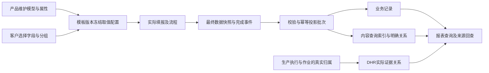

# 电子表单追溯与业务投影落地方案

更新时间：2026-09-29。知识基线：0.3.24。源码核对基点：`f2710af9`。

**文档状态：开发实施中。**2026-09-29 已按用户要求在当前目录创建 `form-traceability-projection` 分支，独立空库 `edhr_form_projection` 已迁移启动。下文原方案中的阶段0说明保留为规划历史；实际实现与验证以第18节为准，不表示全部矩阵或客户试用已经完成。

本文件独立承载电子表单追溯与业务投影的产品设计、工程方案、实施顺序和验收范围。跨模块规则继续以[作业、投影、追溯与 DHR 汇总业务边界](transaction-traceability-dhr-business-rules.md)及对应知识决策为依据。作业状态机、生产执行、DHR 汇总审批的完整设计不在本文重复维护。

朋友及业务评审读者可先阅读[方案简版](form-traceability-projection-brief.md)。本文作为开发接手的主设计稿；简版是面向读者的摘要，不能将其中省略的条件视为取消。新上下文从第17节开始定位接手资料和防偏离要求。

## 1. 阅读方式与方案摘要

| 标识 | 含义 |
| --- | --- |
| C：用户已确认 | 来自当前讨论的明确要求，可以进入本次知识决策 |
| B：既有设计边界 | 已存在的业务契约；其成熟度仍以知识基线为准 |
| P：候选实现 | 为实现目标提出的交互、数据或工程方案，尚未作为已实现能力 |
| Q：待确认口径 | 会影响相应功能结果的问题；实现依赖部分前必须解决 |

产品目标是让客户保留熟悉的普通表单字段，在需要时选择数据来源，让系统能够按批次、SN、设备或其他信息查到记录，并生成报工、报废、消耗等报表所需数据。

候选方案概括为：**产品方预置业务模型和属性定义，客户选择来源，统一取值与投影，多种报表复用结果。**

- 字段类型决定怎样填写，例如文本、数字、单选、引用、子表。
- 业务属性决定这个值在已支持模型中的含义，例如报废记录的分类。
- 投影配置说明从哪些字段或业务上下文取值，以及怎样保持明细对应关系。
- 报表定义查询、展示与分组，不另建一套字段含义。
- 按内容查找表单，与生成实际消耗、报废等业务记录具有不同的信息要求。

## 2. 已确认要求与本期边界

### 2.1 C：用户已确认

1. 查询动作发生在报表菜单；表单设计器负责配置可用的数据来源。
2. 不是所有客户表单都需要追溯字段或统计投影。没有配置统计用途的表单仍可正常填报并沿实际生产关系归集证据。
3. 统计模型由产品方事先定义与维护，客户只选择字段、配置取值关系、核对结果。不得把建立统计模型或编写投影代码交给客户。
4. 已有产出汇总与固定用途代码属于试验实现，可以按更合理的统一方案替换。避免多个模块各自维护字段用途、取值规则与统计口径。
5. 新增展示、筛选和分组维度是需要考虑的扩展需求；“报废后自动扣库存”等新业务动作另走业务需求，不纳入本次。
6. 低配置复杂度、低学习成本和便于实施培训是核心验收目标；不能凭原型或点击次数直接宣称已经达到。
7. 开发前先完成独立方案文档，原跨模块文档仅作相关修正。用户倾向在当前项目目录使用可推送到 GitHub 的功能分支，供朋友拉取评审。

### 2.2 B：沿用既有业务边界

- 模板提供稳定字段及分组身份、受控版本、表单实例、最终数据快照及语义绑定；作业与投影模块解释契约。
- 非流程表单提交即完成时发布最终投影；流程表单在最终结束后使用最终值。暂存、首次提交、退回和再提交不产生正式统计结果。
- 重复事件必须幂等，变更与作废须保留历史并支持解释失效或冲销。
- DHR 由生产执行、作业等真实关系形成并持续归集。表单投影不创建 DHR，也不以批号文字相同决定归属；DHR 证据可见性与最终业务投影分别治理。
- 模板字段权限、业务来源授权、签名、生产快照和 DHR 冻结版本继续使用既有契约。

### 2.3 P：首轮开发目标与明确暂缓

首轮建议打通“普通字段建表—配置取值—发布—真实填报完成—投影—报表查询—来源回查”，以表单追溯、报工记录、报废记录、物料消耗及其必要批次关联为核心。

原始需求中的“不良原因及数量统计”也要保留目标位置：作为报工相关的不良明细模型规划；没有原因分项数量时只能展示现有信息，不能自动拆分总数量。其数量口径见 Q4。

灭菌、检验、放行任务的完整事件追溯，长期记录本的独立生命周期，以及复杂成品组件谱系，需要对应来源模块或额外契约。它们列入完整规划及依赖表，不能用本轮表单配置界面代替实现。AI 辅助作为可选增量；人工配置闭环不依赖 AI。

## 3. 当前能力与原始证据

### 3.1 原始源码核对（original-evidence）

| 源码 | 当前可确认能力 | 对本方案的意义 |
| --- | --- | --- |
| [字段模型](../../gmp-platform/frontend/src/pages/master-data/template-designer-react/types/model.ts) | 普通字段有稳定 id、类型及 typeConfig | 复用字段身份，业务含义不必增加控件类型 |
| [设计器外壳](../../gmp-platform/frontend/src/pages/master-data/template-designer-react/TemplateDesignerReactShell.tsx)与[画布面板](../../gmp-platform/frontend/src/pages/master-data/template-designer-react/tabs/canvas/CanvasTab.tsx) | 字段设计、表单设计、流程设计及字段配置面板 | 可承载统一配置入口，不需要重做表单画布 |
| [现有用途选项](../../gmp-platform/frontend/src/pages/master-data/template-designer-react/utils/fieldBusinessPurpose.ts)与[产出汇总](../../gmp-platform/backend/src/main/java/com/zencas/edhr/production/service/ExecutionOutputSummary.java) | 三类固定用途；按当前表单已保存数量汇总 | 是待收敛的试验机制，不是新模型必须保留的约束；也不能当成最终统计引擎 |
| [实例查询](../../gmp-platform/backend/src/main/java/com/zencas/edhr/production/service/FormInstanceQueryService.java) | 元数据查询、生产来源授权、实例详情 | 复用身份和授权；尚不等于任意内容查询已实现 |
| [执行快照](../../gmp-platform/backend/src/main/java/com/zencas/edhr/production/service/ExecutionSnapshotBuilder.java)与[实例记录](../../gmp-platform/backend/src/main/java/com/zencas/edhr/production/service/FormInstanceRecordService.java) | 已有冻结上下文及实例记录集成点 | 新投影应接入既有生命周期，不再创建第二套表单实例 |

本次只读核对没有执行这些运行模块的全套回归，不能据表中源码推断发布验证已经完成。

### 3.2 客户原表核对（original-evidence）

资料根目录为本机 `安速康表单`；以下文件名和单元格区域可用于定位原件。原件与真实生产数据不随功能分支上传；演示使用经整理的模板结构及虚构填写值。

| 原表与区域 | 已观察结构 | 配置应表达的内容 | 不可自行推断 |
| --- | --- | --- | --- |
| `安速康生产/刀头/CX11-ZYJ11-06-JL01 刀头生产及检验记录-末道清洁 A0.xlsx`，Sheet1 A3:J16 | 酒精批号、合格/不合格数量、无尘布更换数、签名、NCR编号 | 批号查表、数量来源候选、单据关联 | 酒精没有用量；更换数不自动等于消耗数；合格数是否正式报工需确认 |
| `XD生产批记录/XD_CX11-ZYJ01-08-JL01 手柄右壳组件生产检验记录 A8.xlsx`，Sheet1 A4:AB29 | 横向物料/批号/数量，后续成品SN与组件编号 | 按列保留物料组；成品与组件按实际组建立关系 | 不能将所有批号、SN做任意两两组合；数量是否实际消耗及单位需确认 |
| `安速康生产/报废处理单.xlsx`，Sheet1 A5:I10 | 物料、批号、一个数量栏、申请、批准、实际处理及照片 | 报废数据来源与阶段 | 一个数量栏不能证明各阶段处置量相同 |
| `安速康生产/刀头/CX11-ZYJ11-05-JL01 刀头生产及检验记录（组装） A5.xlsx`，Sheet1 A8:I85 | 多个环节重复出现合格/不合格数 | 选择正式结果区域，其他区域保留检验过程意义 | 不把各环节简单累加 |
| `ASK过程检验记录/CX20-JL01 不合格品处理单 A6.xlsx`，Sheet1 A4:J13 | 总不合格数、自由描述、多个类别 | 类别查询与现有总数展示 | 无原因分项数量时不能生成各原因不良数量 |
| `XD 机加工批记录/XD_CX11-ZYJ14-JL01 磨料使用记录 A2.xlsx`，Sheet1 A3:G5及明细 | 每行有工单、零件、磨料、时长、签名 | 行级来源上下文、长期记录关联 | 不能假定整张记录本对应一个批次或一次最终完成 |
| `ASK过程检验记录/手柄及电源适配器DHR复核记录.xlsx`，Sheet1 A4:G16 | 复核记录 | 可只保留记录及既有归属 | 不因无统计字段拒绝使用或排除DHR证据 |

原型已验证部分交互，未验证所有表单完整还原、客户试用、真实投影或生产报表。此前资料扫描和原型说明属于 secondary-reference；本表中的结论以原始 Excel 结构复核为依据，不给出虚假的覆盖百分比。

### 3.3 冠骋参考范围

本机参考工程的 `EDHRFieldTypeEnum` 和 `OnlineFormDataCatchService` 显示，报工、报废、消耗按业务字段类型识别取值。`EdhrReverseTraceBs.java:68–101` 要求已有 DHR，按其主体查询主线表单并查目录，未命中目录时存在来源目录回退。这支持“已选 DHR 范围内找相关表单”的判断，不证明全局按任意批号反查 DHR，更不表示追溯配置会创建 DHR。

这些是 original-evidence；客户新增每一种追溯条件是否都要增加枚举，以及自定义模型是否以预留列实现，现有核对不足以确认。本文不以这些未经核实的假设决定架构。

## 4. 功能矩阵与来源分工（P）

| 报表 | 来源及复用方式 | 首轮目标 / 依赖 |
| --- | --- | --- |
| 生产追溯 | 生产/工序/作业真实事件＋表单实例与内容索引 | 接通表单证据回查；事件全集需单独验证 |
| 灭菌追溯 | 灭菌任务事件、作业、关联表单 | 统一数据契约预留接入点；任务模块不可由配置伪造 |
| 检验追溯 | 检验任务事件、过程记录、关联表单 | 同上，填写检验表不等于任务生命周期已经实现 |
| 放行追溯 | 放行任务、决策事件、关联表单 | 同上，不改变现有放行或签署边界 |
| 表单追溯 | 实例号/状态等元数据＋授权内容索引 | 首轮核心；查询结果打开准确的来源实例及修订 |
| DHR追溯 | DHR元数据＋实际关联实例＋内容索引 | 首轮复用既有归集关系；当前视图和冻结版本须区分 |
| 记录本追溯 | 记录本、条目及内容索引 | 待Q3，不能以一张生产表单代替完整记录本模型 |
| 批次追溯 | 生产上下文、明确的物料使用/设备/人员关系 | 首轮接通有证据的基本关系；复杂组件SN谱系另验收 |
| 报工记录 | 正式报工记录及对应数量、单位和来源 | 首轮目标；正式来源与跨表重复问题受Q2约束 |
| 报废记录 | 报废对象、数量、单位、原因/分类、来源 | 首轮目标；统计阶段受Q1约束 |
| 消耗记录 | 实际消耗物料、批次、数量、单位、来源 | 首轮目标；不能从出现批号直接生成消耗事实 |

原需求中的不良原因统计作为报工相关明细保留，受 Q4 约束。统计扩展不授权库存扣减、自动放行或其他新业务动作。

## 5. 用户角色与配置交互（P）

### 5.1 所有权

产品团队定义标准业务模型、属性、校验、查询能力和扩展属性发布包。实施人员复用这些能力完成客户模板配置；客户制表人员可以调整合法来源并核对预览。现场填写人员继续填写普通字段。

第一期不向客户开放统计模型设计器、任意SQL、脚本或自由创建业务动作。若新增责任班组等属性，由我们通过受控目录提供；具体由产品版本携带还是项目配置包发布，在实现时按同一目录契约处理，不能分散成客户条件分支。

### 5.2 入口与完整路径

保留“字段设计／表单设计／流程设计”结构，在表单设计中增加：

1. **全表入口“追溯与统计”**：查看已配置用途、待补信息、来源与预览；无需先把整张表归为某一种场景。
2. **字段配置折叠区“数据用途”**：从当前字段发起或修改一条对应关系，自动带入当前字段；多字段业务记录在较宽面板集中核对。
3. **可选AI候选入口**：生成同一配置的草稿，继续走相同校验和人工确认。

三种入口引用同一配置ID，无入口专属副本。一个模板可没有用途、只有查表用途，或有多种用途。配置过消耗后，相同来源事实提供的查询关联直接复用；报表选择不会重复生成事实。

推荐路径：先建普通表单 → 按需添加用途 → 系统提出已有字段/上下文候选 → 高亮来源与分组 → 补齐必要信息 → 预览 → 保存草稿 → 发布时统一校验。

### 5.3 配置界面必须表达的内容

- 目标需要什么信息、当前从哪里取值，以及哪些已由生产上下文提供。
- 哪些字段属于同一条明细，是每行一条、每列一条，还是整表一条。
- “按批号找表”只建立查询条件；“实际消耗”需要对象、数量、单位及相应含义。
- 不完整配置可保存为草稿；启用的用途必须完整才能发布。停用用途也须在概览中可见，不能偷偷跳过。
- 缺失、类型错误、跨组错配、单位不明、重复映射和未定业务口径就地说明，不用技术堆栈信息替代提示。
- 删除字段、改变数据类型或拆分分组时，列出受影响用途；不能悄悄指向另一个同名字段。
- 不配置用途不阻止普通表单发布；其原有字段、流程和签署校验仍适用。

### 5.4 预览与减少重复劳动

预览采用与正式运行相同的取值、分组、验证和转换逻辑，只不保存业务结果。使用模拟填写值或按权读取的样例；明确无真实投影、DHR创建或统计累加。

展示“将产生几条记录、每条来自哪个区域、在哪些报表可用、点击后回到哪份表单”。一条消耗记录被多个视图读取时，应直观显示为同一条记录的不同查看方式。

模板新版本继承仍有效的稳定字段配置；同客户相似模板可以复用我们提供的配置样例。仅同名不足以自动确认含义，系统建议始终可检查与纠正。

## 6. 统一配置与属性模型（P）

### 6.1 四类对象

| 对象 | 作用 | 稳定身份与版本 |
| --- | --- | --- |
| 模型定义 | 产品方维护报工、报废、消耗、不良明细等记录所需信息和校验 | modelId＋modelVersion |
| 属性定义 | 如报废分类、责任班组、客户处置编号；定义类型、字典/引用范围和允许用途 | attributeId＋definitionVersion |
| 模板投影配置 | 目标属性到来源的映射、记录分组、启用用途、校验及预览说明 | bindingId／recordGroupId，随模板版本冻结 |
| 投影批次及结果 | 记录哪份最终数据、哪版规则形成了哪些事实和索引 | projectionBatchId、sourceRecordKey、来源修订 |

名称仅用于显示。不同业务中的“分类”不能仅因同名合并；同一“报废分类”被查询和统计使用时复用同一属性身份及字典，避免追溯分类与业务分类各造一份。

### 6.2 支持的取值来源

- 普通主表字段：稳定 fieldId。
- 明细字段：稳定分组/列字段身份＋行或列记录键，不使用可变的屏幕坐标作业务身份。
- 生产、工序、作业上下文：通过受控字段目录读取；没有上下文的入口须在模板绑定或发布校验中明确条件，不伪造值。
- 受控常量及字典/主数据派生：只允许模型声明的简单取值，保留选择依据；不提供任意代码表达式。

字段被多处展示不意味着多份数据。重复引用同一来源值不能自动重复计数。跨明细区域取值应明确关联键，不能自动做笛卡尔积。

### 6.3 固定业务字段与扩展属性

核心业务身份、数量、单位、有效性、来源实例和修订采用明确契约；扩展属性承载新增展示、筛选与分组需求。

建议采用固定业务列＋有类型的JSONB扩展值＋版本化属性定义。查询属性通过受控目录生成条件，并根据实际负载建立索引。JSONB本身不提供类型、授权、报表能力或良好性能，这些必须由统一服务实现。

第一期扩展范围建议为单值文本、数字、日期、字典引用和已存在的主数据引用。多值分组、自由公式、任意嵌套模型和新的业务关系，不默认随新增属性开放。

不预留 `text_01`、`number_01` 等空列供不同含义反复占用。定义一经被发布版本使用，身份不能复用给另一个含义；改名与语义变更分别处理。发生类型或语义变化时生成新定义并验证兼容，不静默改写历史。

新增“责任班组”的目标流程：我们提供属性及合法值来源 → 客户关联表单字段 → 报表目录可选该列/条件/分组。此扩展不能要求每个报表再写一套客户专属抓取代码。

### 6.4 标准模型的最低信息

| 模型 | 必须能够解释的信息 | 限制 |
| --- | --- | --- |
| 查表索引 | 属性、原始值及类型、来源实例/修订/字段路径/明细位置 | 查到同一文本不证明两个业务对象相同 |
| 报工 | 生产主体、相关工序/作业、正式来源、数量种类、单位、发生依据 | 不加总重复工序、重复表单或检验环节；见Q2 |
| 报废 | 报废物料/对象、批次、数量、单位、统计阶段、原因/分类及来源 | 所属生产批次与报废物料批次分别表达；见Q1 |
| 消耗 | 生产主体、实际使用的物料及批次、数量、单位、来源 | 单有批号可以查表，缺少用量不能生成数量事实 |
| 不良明细 | 所属记录、原因/类别、数量、单位及计数口径 | 同一件可有多缺陷时不得把缺陷次数冒充不良品件数；见Q4 |

字典新增选项与新增属性不同。若报废分类可由报废原因的受控关系得到，可以派生并记录当时依据；不得每次查询时连接最新字典，导致历史分类无解释地漂移。

报废“申请量／批准量／实际处理量”表达数量含义，不自动改变既有最终完成投影时机。若需要审批过程中的阶段性正式记录，必须另行确认对应事件契约，不能由选择一个统计口径绕过最终完成边界。

## 7. 投影运行与数据一致性（P，遵守B类边界）

### 7.1 版本与幂等

- 已发布模板冻结配置、依赖的模型/属性版本及配置摘要。生产执行按既有快照契约读取，不在实例最终完成时临时使用最新模板配置。
- 最终事件保留 `formInstanceId`、`finalRevision`、模板版本与hash、规则版本、最终值快照引用、上下文及审计引用。
- 沿用 `formInstanceId + finalRevision + projectionRuleVersion` 的批次幂等键；每条结果还需稳定 binding/recordGroup/rowKey，不能靠数组当前位置维持跨修订身份。
- 同一批次的重复触发、失败重试不能重复入账。多个表单描述同一事实属于业务重复，不能靠批次幂等键解决，见Q2。
- 同一来源修订换规则重建时，保留原批次与原因；新旧结果切换必须保持单一有效集合，避免两版同时参与统计。

### 7.2 持久化与失败恢复

候选实现采用持久化待处理事件及幂等消费者：完成状态与待处理事件在同一事务记录，投影结果、索引和批次成功状态在一个事务发布。执行失败保留可重试状态，不让部分记录成为有效统计。是否接受最终完成与报表结果之间的短暂延迟、哪些失败须阻断完成，仍按Q5确认。

最小状态可表达待处理、处理中、成功、失败、失效；具体枚举和数据库表名在实现设计中收敛。需要并发认领、失败原因、重试次数、最后执行时间及管理员重试入口。不可仅依赖内存监听器，导致服务重启丢失待投影事件。

报表应能区分“没有记录”“尚待投影”“投影失败”。查询成功与零结果不能掩盖处理异常。监控、重试及重建权限属于产品运维能力，客户制表人员无需理解事件系统。

### 7.3 变更、作废、历史与来源定位

受控表单变更产生新修订，作废/替代使相应当前有效结果失效或冲销，旧快照与审计保留。切换有效结果必须与规则定义一致，不能直接物理删除历史。记录控制集成未闭环时，不得宣称可进入正式生产使用。

每条业务记录保留来源实例、修订、模板版本、映射、明细位置与投影批次；点击历史记录应查看形成该记录的来源快照，不自动跳到已修改的最新值。

DHR当前证据查询与冻结版本查询明确区分，后者沿冻结成员及引用的数据版本解释。新增索引或规则重建不得改写已冻结DHR成员、内容和批准状态。

本方案的正式内容索引按既有最终投影时机发布；未完成表单仍可作为DHR实际证据出现，并通过已有元数据与来源入口查阅，但不能据此声称它已经拥有最终内容索引。若要搜索进行中填写值，需单独定义明确标识的工作视图，不与最终索引混用。

## 8. 查询、关系与报表复用（P）

### 8.1 同一业务属性多处使用

报废记录的分类同时用于报废分组和来源表单查询时，保持同一属性与来源链，不建立“追溯报废分类”第二个定义。

一条“生产P消耗物料M的批次L、数量Q、来源F”的记录可以供消耗列表、批次追溯及按L查F读取；不因报表数量增加而多计消耗，也不自动生成报工或报废记录。

### 8.2 查询粒度与身份

- 同一明细上的“物料批次＋责任班组”等组合条件必须在同一条记录上成立，不能分别命中不同明细后拼成假结果。
- 多个匹配明细返回同一表单时，表单列表去重并展示命中位置；业务统计按事实粒度计数，不按联表展开行数计数。
- 明确区分设备使用人、填报人和签署人。输入相同姓名不能自动建立人员身份关系。
- 物料批次、生产批次、SN、设备和单据使用各自类型及身份范围。只有文字且尚未解析为业务身份时，可以作为文本查表，不能冒充已验证的实体关系。
- 相同批号跨物料或来源范围的唯一性、手输编号的解析与确认策略见Q6。
- 分组统计不混加不同单位；转换须有明确换算依据。没有结果时不自行用0替代未知或失败。

### 8.3 权限

模型目录中的“可查询”只声明支持能力。实际检索、聚合、结果数量、导出、来源快照与附件访问均须遵守来源及字段可见性；不能先聚合所有数据再仅隐藏详情。

复用现有实例与来源授权，不新建可绕过生产/DHR权限的万能查询接口。第一期继续沿当前租户契约，不因新增查询入口宣称多租户隔离已完成。

## 9. API及代码所有权规划（P）

接口名称为职责建议，不作为已发布契约：

| 接口职责 | 输入与输出要点 | 所有者 |
| --- | --- | --- |
| 读取可配置模型/属性 | 当前产品支持范围、类型、字典引用、所需上下文、可查询能力 | 投影模块 |
| 保存模板配置草稿 | 稳定字段和分组引用、版本并发控制；返回逐项错误 | 模板模块 |
| 校验/预览 | 与正式解释器一致；返回候选结果、来源位置、错误和影响报表，无业务写入 | 模板＋投影模块 |
| 发布/冻结 | 在既有模板发布事务纳入配置及目录版本，处理不兼容引用 | 模板模块 |
| 接收最终完成及失效 | 既有运行引擎事件、最终修订、幂等与可靠投递 | 生产/作业＋投影模块 |
| 报表查询和来源回查 | 受控筛选、分页、单位与事实粒度、快照定位和权限 | 报表模块 |
| 投影状态/重试/重建 | 批次、原因、规则与快照、操作者、审计和授权 | 投影运维 |

前端集中实现模型目录、配置编辑器、来源选择、分组校验展示及预览结果，不让每个报表维护自己的字段映射组件。后端集中实现取值与校验、投影生命周期和来源身份；不同业务记录保留清晰模型，避免万能大表或全能脚本引擎。

扩展路径采用 `product-core + configuration`：标准业务能力由内核实现，差异在受控目录和模板配置中表达。当前范围不引入项目插件、库存动作、通用规则编辑器或图数据库。

## 10. 旧试验实现的收敛与历史处理（P/Q）

用户允许替换试验逻辑，但未授权删除历史业务证据。实施前清点 `businessPurpose` 使用位置、模板/生产快照、现有数量汇总消费者及数据。

1. 先建立统一配置与解释契约，再将设计器入口和相关读取迁移到同一来源。
2. 对旧三类数量用途，只能在含义与来源明确时提出转换候选；不能把已有已保存汇总自动认定为正式报工或报废。
3. 生产工作台如仍需要进行中数量，只能明确展示为过程参考值；是否保留及正式数如何呈现，见Q7。不能把过程值混入最终报表。
4. 历史证据、旧模板版本及生产快照保留；一次性转换、重建或可重造演示数据分别清点，处置策略见Q8。
5. 切换后移除已被替代的本功能旧配置写入路径及重复算法；必要的历史读取兼容有明确范围和退出条件，不能长期运行两套权威统计。

## 11. AI辅助配置（P，可选增量）

AI只生成候选映射、分组建议和缺失信息说明。请求只包含允许发送的字段、类型、结构、业务目录与示例；客户模板也可能保密，数据出域范围需按客户要求确定。生产运行按发布后的确定性配置执行。

候选输出受结构校验、属性白名单、字段存在性、类型、组内关联和业务口径校验限制；预览并由人确认后才能发布。不能让模型决定报废阶段、猜测缺失数量、自动跨组配对或改变DHR归属。服务失败保留用户输入和人工配置能力。

优先评估服务端调用线上API；离线或禁止出网时再评估本地模型。服务商、模型版本、密钥、额度和日志由服务端管理；模板/附件中的文字按输入数据处理，不能作为执行指令。

成本分为模型调用、集成与解析、评测、运维及人工纠正。以每次输入/输出token及调用次数测算，真实上线前按供应商官方当期价格核价并用代表样本实测。此前原型费用只是自设用量估算，不是开发总预算或真实准确率证明。

## 12. 待确认的实现口径

这些问题不阻塞编写本文、公共契约草拟或配置原型，但会阻塞相应运行功能定版。候选建议不得默认为用户已确认。

| ID | 问题 | 建议如何确认 | 阻塞范围 |
| --- | --- | --- | --- |
| Q1 | 报废报表统计申请、批准还是实际处理；是否需分别查看 | 用报废单走一例，明确数量来源与事件含义 | 报废正式模型发布及验收 |
| Q2 | 同批多工序/多表的报工、报废谁是正式来源，哪些是重复描述 | 每类记录指定事实粒度、正式来源及关联依据 | 跨表聚合、业务去重 |
| Q3 | 长期记录本按条还是整本生效，条目如何跨工单关联 | 以磨料日志核对记录单位与生命周期 | 记录本与跨工单长期记录投影 |
| Q4 | 不良数量统计件数还是缺陷次数；多原因是否互斥 | 明确是否需要原因分项数量及采集结构 | 不良原因数量统计 |
| Q5 | 投影失败/延迟是否阻断表单最终完成或下游动作 | 区分必要业务校验失败与投影处理故障 | 完成事件与投影事务边界 |
| Q6 | 批次、SN、设备、班组等身份范围及自由输入的解析规则 | 核对现有主数据及客户编号；文本查询与实体关系分开验收 | 关系追溯和引用有效性 |
| Q7 | 生产工作台是否保留进行中数量参考，如何与正式报表区分 | 查看原数量用途消费者并确认页面含义 | 替换旧汇总的用户行为 |
| Q8 | 旧试验模板、已启动实例及历史数据保留/转换/重建范围 | 清点数据后形成具体处置清单 | 迁移及正式切换 |

## 13. 实施顺序与阶段出口（P）

| 阶段 | 交付内容 | 可检查的出口 |
| --- | --- | --- |
| 0 设计评审 | 本文、已确认知识、影响分析、待确认口径 | 已进入实现；当前交付及未覆盖项见第18节 |
| 1 统一契约 | 模型/属性目录、模板配置、类型与分组引用、版本策略 | 新增既有能力范围内属性无需新增字段类型；校验非法类型及错组 |
| 2 产品内配置 | 全表及字段入口、候选来源、预览、草稿与发布校验 | 在真实设计器配置安速康代表性结构，刷新、改版、删除字段行为明确 |
| 3 运行闭环 | 完成事件、快照、幂等投影、失败恢复、变更作废集成 | 重复/并发不重计，退回不投影，来源修订可回查；先解决依赖Q项 |
| 4 报表与演示 | 表单追溯、报工、报废、消耗及基本关联，GitHub分支运行说明 | 同一虚构样本从填报到报表再回查闭环，权限及单位正确 |
| 5 客户试用与可选AI | 普通客户制表者任务试用、模型建议评测 | 得到实测纠正/求助/错误数据，达成商定门槛后才声称易实施 |

阶段1和2的无依赖工作可以推进，不用等待穷举所有业务领域。阶段3按已确认的业务记录逐项完成，不能把待确认项设成随意默认值。矩阵中的来源模块扩展与复杂谱系按第4节依赖单独排期；阶段4演示不冒充全矩阵验收。

## 14. 验收与培训验证

### 14.1 工程验收场景

| 编号 | 场景 | 期望结果 |
| --- | --- | --- |
| A01 | 表单不配置统计用途 | 正常设计填报，既有DHR归集仍工作 |
| A02 | 批号字段开放查询 | 报表找到正确实例及命中位置，字段类型保持普通 |
| A03 | 报废分类已在模型中使用，再开放查询 | 复用属性及来源，无第二种字段类型，无重复记录 |
| A04 | 我们新增责任班组属性，客户关联字段 | 在受支持范围内展示、筛选、分组共用目录，无报表专属抓取分支 |
| A05 | 横向两组物料及批次/数量 | 生成两条正确对应记录，不交叉配对 |
| A06 | 多环节数量、同字段多处展示 | 只采集正式来源，不按展示次数或多个环节重复统计 |
| A07 | 没有用量、单位或明确口径 | 就地指出缺失；可保存配置草稿，不能发布不完整的启用用途 |
| A08 | 组合条件分别存在于两条明细 | 不将其伪装成同一条业务事实命中 |
| A09 | 暂存、提交待审、退回再提交、最终完成 | 仅按合法最终完成时机生成正式投影 |
| A10 | 重复事件、并发消费者、部分写入失败、重试 | 一个有效结果集合，失败可恢复且不重复累加 |
| A11 | 改版、重命名、删字段、换类型或分组 | 历史版本解释稳定；新版本显示受影响配置并校验 |
| A12 | 表单变更、作废、规则重建 | 旧结果与审计保留，当前有效统计可解释地切换 |
| A13 | 无来源权限或字段不可见 | 搜索、数量聚合、导出及来源详情均不泄露 |
| A14 | 按物料批次回查表单及DHR | 沿真实关系；不凭字符串相同创建或改变归属 |
| A15 | 当前值与冻结DHR版本不同 | 历史回查展示对应快照，不偷换为最新值 |
| A16 | AI错误建议、跨组建议、服务不可用 | 校验和人工预览阻止错误发布，人工路径可继续 |

这些是完整方案的验收场景；实际执行与未覆盖项以第18节及运行说明为准，不把静态原型测试复用为生产通过结果。

### 14.2 客户学习成本验收

用未参与设计的客户制表人员完成：按批号查表、配置一组消耗、关联新增责任班组、纠正一次故意错配、修改模板后修复受影响配置。简单和复杂样本分别测试；样例不能只选择最整齐的表单。

记录完成时间、求助次数、关键错配、纠正次数，以及能否解释“表单出现批号”和“实际发生消耗”的区别。与原逐字段方式在相同任务下对比，统一培训材料，避免熟悉程度偏差。具体人数、时间与通过阈值在试用前商定，本轮不捏造保证值。

培训只围绕“要查什么/记什么、值在哪里、预览是否正确”三件事；模型、数据库、属性版本和消息处理属于产品维护职责。我们先配置少量代表样板，再验证客户能否独立修改与复用，不能以实施人员替客户全做完作为易用性证明。

## 15. 分支、GitHub共享与演示环境

Git分支记录提交；worktree是在另一目录检出一个分支，两者都能正常提交并推送同一个GitHub仓库。朋友拉取远端分支不需要知道开发者是否使用过worktree。

按用户后续明确命名，已在当前项目目录由 `edhr-dev` 的 `f2710af9` 创建 `form-traceability-projection`，评审后再合并。本功能未提交文档随分支保留，无关输出目录不提交。

开发并验证后，通过普通提交和 `git push -u origin form-traceability-projection` 共享。用户已授权提交和推送；门禁通过前不宣称交付完成。

分支与worktree都不会自动隔离数据库、端口或外部服务。演示交付必须附：依赖及启动命令、单独数据库配置、迁移步骤、虚构种子数据、演示入口、验收脚本和已知限制。用环境变量或本地配置提供凭据，不提交密钥、客户原始表单或真实生产数据。

是否本机演示、朋友本机运行或部署独立演示环境，按实际评审方式选择；能拉到分支不等于已经得到可运行的演示环境。

## 16. 文档维护与本轮完成条件

本文是本功能唯一主设计稿，后续纠偏与实现证据在此增量更新，避免并行维护互相矛盾的用途方案。跨模块文档保留职责及不变量，结构化知识只吸收明确确认的结论。

本次[决策包](../development/form-traceability-projection-decision-package.yaml)保存已确认职责、影响分析和扩展路径。本切片已从文档进入首次完成闭环开发，执行 L2 单元、集成、迁移、权限、浏览器及独立质量验证；实际证据以[运行说明](../development/form-traceability-projection-running.md)和单独门禁结果为准。客户试用、AI、生产切换及第18节未覆盖项保持后续工作。

## 17. 跨上下文接手与开发检查清单

本节整理前述约束供后续开发接手，不新增业务决定。本文的P类方案仍须在对应切片明确采用范围，Q项不能因换了上下文而变成默认规则。

### 17.1 接手时先核对什么

1. 读取仓库 `AGENTS.md` 和 `codeplzreadme.md`，检查当前分支、提交和未提交改动。本文件记录的源码基点与检查结果只代表记录当时，不能当成当前状态。
2. 读取本文第2、4、12、13节，明确已确认职责、首期边界、依赖问题和当前阶段。随后读取[跨模块边界](transaction-traceability-dhr-business-rules.md)、[模型所有权决策](../knowledge/decisions/DEC-0075-form-traceability-projection-ownership.yaml)和[同一切片决策包](../development/form-traceability-projection-decision-package.yaml)。
3. 按第3节的源码入口核对本次要修改的真实实现；清点旧 `businessPurpose` 的写入、读取、快照和汇总消费者。文件名和本文的候选接口职责不能替代调用链核对。
4. 为本次切片列明交付、依赖Q项、对应A验收场景及验证方式。只推进问题已明确的部分；不依赖的公共契约和配置工作可继续。

### 17.2 哪些开发选择最容易偏离

| 容易发生的偏离 | 实现时应保持的约束 |
| --- | --- |
| 为每个新查询条件加字段类型或前后端枚举 | 控件、属性目录和来源配置分开；支持范围内新增属性走同一目录 |
| 全表、字段、AI入口各存一份映射 | 共用同一份配置、校验和预览逻辑 |
| 每个报表重新抓表单数据 | 同一业务事实及来源链复用，各报表按权限读取 |
| 把任意同名字段或同文字编号自动认定为同一对象 | 采用稳定字段/属性身份；实体解析遵守Q6，文本查询单独解释 |
| 横向、纵向明细先展开再任意组合 | 明确保留每条记录的分组身份；组合查询也在同条明细成立 |
| 继续把当前保存值汇总接入正式报表 | 过程参考数按Q7处理；正式投影遵守最终完成边界 |
| 换规则或改表后直接覆盖历史结果 | 冻结版本、保留旧修订和审计，切换单一有效结果集合 |
| 因一个批号能找到表单而自动加入DHR | 沿生产执行与作业的实际证据关系及冻结成员查询 |
| 将简版或原型演示视为全部需求已经验证 | 依第4节区分首期与依赖模块，依第14节提供实际验证证据 |

### 17.3 一个可用于实现自查的最小样例（P）

以下均为虚构数据，不代表安速康原件填写值或已确认消耗口径。前提是已确认实际消耗含义和合法业务身份：生产主体P、来源实例F及最终修订R，横向组G1为物料M1／批次L1／数量2件，组G2为物料M2／批次L2／数量3件。

预览及正式解释器应得到两条记录：`G1 → M1/L1/2件`、`G2 → M2/L2/3件`，每条都保留F/R及对应组定位。不能得到M1/L2这样的交叉记录。按L1查表命中F及G1；消耗报表保留两条事实，重复触发同一最终事件后仍为两条。模板只是换了显示位置或名称时，仍使用稳定身份识别来源。

该样例对应A05、A08、A10。它验证组内对应与技术幂等；同一事实在两张表出现的正式来源选择仍受Q2约束，不能用这个样例绕过。

### 17.4 每个阶段结束后留下什么

- 更新本文对应章节：实际采用的方案、已实现能力、源码与验证证据、仍待解决的问题。文档中计划验收项未执行时保持计划状态。
- 新确认口径回写第12节及同一决策包，由本体角色同步适用知识；保留问题与决定的依据，不把P/Q直接删掉伪装成既定事实。
- 按第13节给出可复验的阶段出口；涉及历史切换时附数据清点、迁移及恢复验证，供朋友运行时附第15节的演示说明。
- 业务范围或客户操作变化时同步简版；工程细节留在本文。保持一份主设计与一份易读摘要，避免形成两套方案。

## 18. 当前实施记录（2026-09-29）

### 用户后续确认（user-confirmed）

- Q1：报废数量由用户配置的代表报废数量的字段提供，不强制预设申请/批准/处理阶段。保留字段来源说明。
- Q2：按工序/用途合计并可查明细。同批不同工序的100件不相加称为批次产量200；同工序正式来源记录可累加，重复记载表只配置查表用途。
- Q5：采用先前建议——必要业务校验失败阻止最终完成；完成和待投影事件同事务保存；系统处理故障不撤销完成，明确显示待处理/失败并可重试，依赖正式结果的下游等待成功。
- Q7：保留进行中数量并标为“过程参考”。
- Q8：保留原库和全部旧数据，独立数据库用虚构模板与数据验证。

### 实现与边界

采用 `product-core + configuration`。模板保留一份 `model.projection`，目录版本 `form-projection-v1`；主表每个配置组一条，子表要求显式稳定记录键。文本批号仅提供查询，不自动解析业务身份。消耗/报废物料使用已有物料主数据引用，沿用既有引用合法性校验；不生成未知批次实体关系。

独立数据库、端口和启动步骤见 [运行说明](../development/form-traceability-projection-running.md)。原库只读清点3个模板版本、13份实例、1个旧用途模板，没有复制或改写。

原始源码复核发现现有表单版本保存没有冻结保护，本切片添加显式发布冻结、摘要及并发版本校验。既有受控修订/作废尚无完整来源运行模块，不得以投影接口伪造审批或声称完整生产切换；该缺口需在交付报告明确，继续按已确认范围完成可验证闭环。

2026-09-29 用户已接受本分支先交付首次最终完成闭环，明确 A12 受控修订／作废及规则重建未覆盖。首次来源修订固定为1，不提供绕过来源审批的投影作废接口。长期记录本、不良原因次数统计、自由文本实体解析、AI 和其他来源模块的报表保持未启用。

用户补充确认产出层级：工序报工更新工序产出，批次取配置的最终产出工序，工单汇总各批次。当前工序报表不将跨工序和当作批次产出；本项目最终产出配置仍为规划态，批次／工单正式产出联动未在本分支实现。冠骋原始源码维度和最终产出核对见[参考记录](../development/form-projection-gct-report-reference.md)。

Q3长期记录本、Q4不良原因分项数量及Q6自由文本实体解析继续暂缓，不阻塞文本查表及已有主数据引用范围。灭菌、检验、放行事件全集、复杂组件谱系、AI及客户试用不在本次已实现声明中。

冠骋原始证据：本机 `gct-edhr-bed/.../OnlineFormProcInstEventListener.java:116–130` 在end事件直接调用哈希与消耗抓取；`OnlineFormDataCatchService.java:713–730` 直接保存并调用库存处理；按钮监听器也调用报工/报废抓取。外层事件分发和事务源码未取得，不能断言故障回滚完整审批或存在可靠重试。该参考不改变上述用户已确认Q5。
