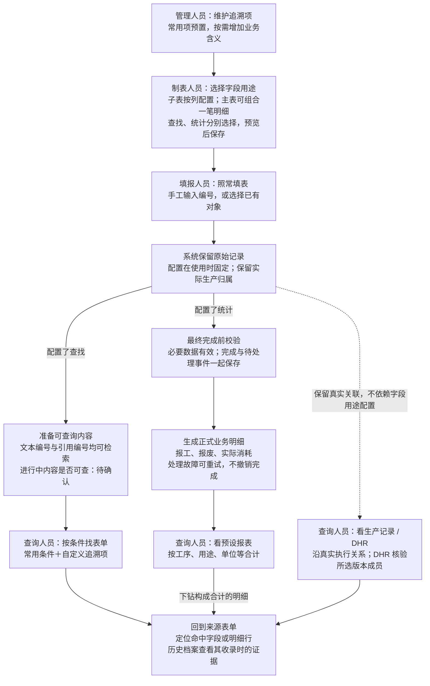

# 表单查找、追溯与统计：开发前整体设计评审

日期：2026-10-07。执行级别：L2。状态：**评审建议，待用户检查流程图及集中决策；不是实现完成或设计批准记录。**

同日后续已按用户授权实施规则明确的[追溯项目录切片](form-lookup-catalog-2026-10-07.md)，本评审保留当时源码判断及其余待定项，不能将历史“未实现”句子当成最新目录状态。流程图使用 Mermaid；不再使用 Archify 产物。

同日侧边讨论已补充三项用户确认：用途驱动的文本匹配与次要展示、追溯项自动进入设计和查询两处候选、新含义对未关联旧实例的补充覆盖排二期。详见[主设计2.5节](../architecture/form-traceability-projection-design.md)。本增量仅作L1文档同步，其本体及独立质量复核待主会话继续；下文原L2评审通过记录不覆盖该增量。Q6/Q9/Q15/Q17未因此整体关闭。用户随后授权主对话交接后检查开发／优化条件，具备条件则开始；这不将其余候选方案自动提升为已确认。

仓库 `/Users/ivenwang/Documents/edhr-nexus`，分支 `form-traceability-projection`，源码基线 `5c2a6a6c3bc78bf03a69da8ff8004f62c88cd199`，知识基线 `0.3.24`。复用 `DEC-PACKAGE-20260929-FORM-PROJECTION`。开始核对时只有既存两个 `output/` 目录未跟踪；本轮新增本评审及图示，只修改决策包的评审索引，不修改产品代码、数据库或运行配置。

## 1. 先看整个流程

[Mermaid 图源](diagrams/form-projection-overview-2026-10-07.mmd)。按用户最新要求，改用 Mermaid 表达；Archify 中间产物不作为交付。

图中的“管理员、制表人、填报人、查询人员”是使用场景，可由同一人兼任。查找和统计分别启用，两者都不选时，表单仍按正常流程填写、完成，并保留实际生产关联。图只展开启用用途后的处理支路；**没有统计用途的表单也正常完成**。DHR 本身还可以从生产档案入口进入，不依赖先做字段内容查询。图中技术处理由系统完成，用户无需学习“投影、索引、行键、事件”。

**结论：方向可继续，但现实现不能只换交互就称为完整 MVP。** 需要补齐统一编号检索、受控引用来源、管理员目录、独立查询生命周期、准确的 DHR 版本回查，以及已确认的最终产出统计。下面明确区分事实、已确认范围和建议，避免把建议当作已有功能。

## 2. 保留的已确认原则

依据：用户讨论及 DEC-0060、DEC-0075-07/10/12/17/18/19/20/21/22，详见既有交接、详细方案和决策包。

- 查找与追溯、业务统计是两个并列可选用途。客户维护可复用追溯项；统计业务模型及统计口径由产品维护。自定义业务报表进入二期，MVP 展示预设报表。
- 子表是配置重点；主表多个分散字段组成一笔业务明细也在首期范围内。查找用途本身不要求客户建立业务明细组。
- 模板继续可编辑；首次生产使用或追加表单时复制配置到实例快照，已有实例继续使用自己的配置。**不增加发布冻结步骤。**
- 系统真实生产身份、给填报字段带入的值、用户填写或选择的值分别处理。字段值不能覆盖实际执行归属。
- 正式统计只在首次最终完成后生成。必要业务校验失败阻止完成；完成与待处理事件原子保存，系统处理失败重试，不撤销完成；依赖正式结果的下游等待成功。
- 报工按工序及用途汇总并能看明细；批次最终产出来自指定最终产出工序，工单产出来自各批次产出之和。不得把不同工序报工相加当成批次产出，也不自行推导产出量等于良品加不良品或减报废。
- 工作台进行中数量可以保留为“过程参考”；DHR 沿真实执行、作业及档案证据关系查询。
- 保留旧数据，后续迁移和演示在独立数据库进行；A12 完成后的受控修订／作废联动明确延期，AI 辅助不是本期依赖。

## 3. 需要修正的关键漏洞

| 问题 | 本次修正建议及原因 | 依据／性质 |
|---|---|---|
| 把“允许文本和引用”理解成两种值天然都可作为业务对象 ID | 内容查询可以兼容两者；涉及对象的正式统计、实际消耗或生产关系，必须具备受控身份和相应业务证据。不能通过字段标签或编号相等自动建立关系。 | 当前解释器只允许物料引用进入正式物料属性；其他查找属性主要接受标量文本。原始源码事实＋设计建议。 |
| 把“引用对象”当成“实际使用对象” | 设备引用可能是计划、备用或实际设备；批次引用可能是当前、来源或相关批次。引用确认身份，正式关系还需要用途和实际业务动作。 | 业务模型边界；原解释遗漏的证据层次。 |
| 假设冠骋 LOT/SN 都存 ID，因此没有混合问题 | 原始 `MaterialNo` 继承 `Text`、映射 `TEXT`；`FormTraceManager` 存批号字符串并存在按名称查容器路径。可借鉴其业务含义和消费者，不能把所有字段概括成统一 ID 契约。 | GCT 原始代码；未运行其全部页面，不能推断所有分支行为相同。 |
| 查找必须等统计成功，导致数据找不到但无法解释 | 两条处理链应独立；查找范围另行确认，明确显示处理状态与覆盖范围。正式统计失败不应抹掉来源表单及其实际关系。 | 当前查询仅筛选 `SUCCEEDED` 投影批次；Q15 未定。 |
| 子表要求客户配唯一字段；主表一上来暴露“记录 4” | 系统维护行身份；子表按列配置，逐行形成明细；仅在主表统计确有多笔事实时，引导“另一笔报废／消耗”。唯一性不能要求业务人员额外填序号来承担。 | 当前解释器及 UI 的行键约束；这是工程设计问题，不需用户决定 UUID 方案。 |
| 找到某批次字段，就声称属于该批次的 DHR | 内容命中、实际生产归属、某一 DHR 版本收录分别展示。进入冻结版本要核验成员及源记录版本，不能拿当前索引值解释历史档案。 | 当前 DHR 导航按 objectId 找档案；冻结校验代码另有成员及哈希证据。 |
| 有重试去重就不会重复统计 | 技术重试幂等不等于业务去重。表头总数与子表明细、同一事实被两表重复记载，需要配置正式来源；合法的多次上料不能因批号相同被去重。 | 当前来源字段重复检查只覆盖部分配置；跨表业务语义未由幂等键解决。 |
| 现有报工统计已覆盖最终产出 | 当前模型主要是良品量、不良品量，缺少已确认的独立产出量及最终工序→批次→工单正式计算闭环。不能用过程参考或良品量默默代替。 | 当前解释器、报表及工作台汇总源码；交付缺口。 |

## 4. 四种角色各自只做必要操作

| 角色 | 主要场景 | 推荐界面与操作 | 不应承担的事情 |
|---|---|---|---|
| 管理人员 | 偶尔增加“供应商批号、灭菌锅次”等可复用含义 | 追溯项管理：名称、简短说明／例子、支持的值类型、是否常用和启用；预置项开箱可用。使用情况可查。 | 写 SQL、定义关系本体、决定自由统计公式；管理目录不自动授予查看全部表单的权限。 |
| 制表人员 | 经常设计子表；偶尔组合主表字段 | 保留同一画布内独立“查找与统计”侧栏；点击字段或子表，分别配置查找含义和预设业务用途；统一保存、撤销、预览。 | 了解索引、数据库 ID、事件或系统行键；不能要求先进入全表大弹窗才能配置。 |
| 填报人员 | 手工填编号，或从对象列表选已有批次／工单／设备 | 原文本框继续输入；引用框按编号和名称搜索并选择，显示可辨认业务信息。必要的完成校验直接定位字段／行。 | 再选一次投影模型；仅为查询而重复选择已输入的批次；输入“数据记录组”。 |
| 查询人员 | 按批次、设备、供应商批号等找记录；查看业务报表或 DHR | 常用条件默认显示，其他条件按需添加；结果先给表单，再展开命中字段／明细行。预设统计报表与来源下钻保持一致。 | 阅读所有映射配置；理解名称相同但语义不同的内部编码；凭空推断“无命中”等于“没有记录”。 |

交互分层：默认只显示当前选中来源；查找勾选后选择含义；统计勾选后才显示模型所需来源。子表配置一次应用各行。主表组合用具体用途名称并允许从画布选配套字段，不把“数据对象／记录组”作为入门概念。预览给出“将产生两条实际消耗明细”“此列仅用于查找”和来源高亮。取消启用与删除配置应分开，避免误点丢失配置；当前删除式开关需改造。

遵循仓库 UI 与列表规范：紧凑表单、统一标签、常用条件区、列偏好及分页、固定表头、来源详情抽屉；侧栏保留滚动和选中上下文。设计稿中的图示样式不是产品页面样式规范。

## 5. 文本和引用如何一起工作

### 5.1 填表时不增加一个“查询框”

制表人在名为“批次号”的文本字段上关联“生产批次号”这个含义；填报人照常填 `B-001`。这是告诉系统**这段已填内容的含义**。查询人员以后在另一个追溯页面输入 `B-001`，系统才据此找表单。模板配置的是含义，查询时输入的是要找的值。

普通文本仍是普通文本。若字段收集的是物料批号、供应商批号或相关批次，选择对应含义，不能为了通用而全归入“批次”。编号前导零、大小写、空格等采用各含义明确的规范；保留原始值，不擅自把所有文本转数字或模糊归一化。

### 5.2 混合类型的具体结果（建议契约）

以下编号为虚构示例。

| 输入情况 | 查询“生产批次号 B-001” | 正式统计／生产关系 |
|---|---|---|
| A 表文本输入 B-001，关联生产批次号 | 命中 A，标记“填写编号”，定位原字段 | 可作为内容证据；单凭字符串不能产生对象关系。 |
| B 表选择 B-001 对象，关联相同含义 | 同时命中 B，标记“引用对象”，保留身份和当时编号 | 已有对象身份；仍按业务用途及真实执行上下文决定事实含义。 |
| C 表同时有上述两个字段 | C 表结果只出现一次，展开显示两处命中 | 不因两处查找命中生成两笔报工或消耗。 |
| D 表实际属于 B-002，却在“相关批次”填写 B-001 | 在相应内容条件下命中，明确实际归属为 B-002 | 不把 D 改归 B-001；DHR 仍按实际关系和收录证据查询。 |
| E 表同批同物料上料两次 | 一张表、两行命中，可分别定位 | 两次合法事实均计入，不能按相同批号去重。 |

默认编号查找覆盖兼容的文本值和引用的**编号快照**。引用选择建议保存：受控对象类型、ID、业务编号快照、显示名称快照及来源位置；编号与名称分开。当前 `{id,name}` 中 `name` 来自可配置展示字段，不保证是编号，直接拿它当统一键不可靠。引用对象重命名不能改变历史原始记录；新选择可用性校验和历史已选值解释要分开。

用户在查询框选中 B-001 的对象建议后，也不能悄悄切为仅 ID 查询而漏掉 A 表文本。若提供“仅明确引用此对象”，必须作为可见的额外限制。跨工厂／产品的同码对象先按明确范围区分；无法区分的文本结果保留“编号匹配”，不自动绑定任意对象。

**正式统计的边界必须诚实：** 不强制所有客户表单改用引用；但某项统计要按具体物料等对象汇总时，其身份必须可靠。推荐 MVP 先支持受控引用、真实上下文，以及无需实体身份的文本属性。若希望文本物料号也进入按物料对象汇总，需要另补受控编号解析：范围内唯一匹配才可采用，零／多匹配明确处理，保留解析证据；此能力对应 Q6，不能宣称现已支持，也不该把错误留到最终完成才首次提示。制表时就应解释来源不兼容的原因并提供可选替代。

**2026-10-07侧边确认：** 普通文本只有在明确配置了对应物料用途时才触发相应身份匹配，不能凭字段名或输入形态猜测。匹配信息采用次要展示，优先hover，避免遮挡其他单元格；建议用轻量标记并兼容聚焦／点击查看，不常驻撑开表格。正式统计的阻断错误仍须可见并定位。此条件不取消原生引用字段自己的查询、选取及校验，也不等于Q6唯一性／解析范围或首期纳入已经全部确认。

### 5.3 三种上下文不能混在一起

| 类别 | 示例 | 对归属与历史的影响 |
|---|---|---|
| 系统实际身份 | 此实例属于哪个执行对象、工单、路线工序节点 | 由执行关系确定，用户字段不能覆盖；不依赖配置追溯项才存在。 |
| 给字段带入的值 | 用实际批号预填表头，减少重复录入 | 复制时点、可编辑性、缺失及刷新需要规则；不是一个新报表用途。建议绑定时复制，重开不刷新。 |
| 填报采集的业务内容 | 输入供应商批号、选择领用物料、填写数量 | 按配置用于查找或形成特定业务事实；有自己的证据语义。 |

设备可能不止一台；不得默认取第一台。共享表头时，仅把明确的身份、描述或单位维度应用到对应子表；不能把表头总数量复制到每行累计。带入字段变化也不重写真实生产身份。Q9、Q17 的具体范围在第 11 节集中说明。

## 6. 目录、检索、生产追溯与 DHR 的闭环

查找目录需要稳定身份及定义版本。显示名称可以更改；改变对象种类、值类型或含义不能静默复用旧定义。被使用的项停用后，禁止新配置使用，但保留历史解释与合法查询能力。目录生命周期的具体实现仍为建议。

**2026-10-07侧边确认：** 管理员新增可用追溯项后，设计侧兼容字段的追溯用途候选和追溯页条件候选均自动从同一目录获得它，无需二次维护页面条件，也不要求先有绑定或命中数据。制表人明确关联字段，查询人选择条件再输入值；新增候选不等于已有记录已经覆盖。

**历史补充覆盖已排二期：** 旧实例快照未关联新查找含义，即使字段名或值相同，MVP也不自动使其命中；新增配置供后续采用该配置的新实例使用。为新含义回填旧绑定、补索引或重新解释旧实例进入二期TODO，原有查询和证据仍须保留。未来按原快照重建已有索引与用新规则重新解释历史须分别治理，不能改写原记录或已批准DHR。本分期不取消已有含义的正常维护和查询。

查询建议先覆盖精确文本、单选及受控引用的编号／身份；数字、日期范围等按实际交付能力开放，不做一个名义上支持全部类型但无法查询的目录。客户可增加“灭菌锅次”，但这不自动创建灭菌任务模型、设备使用关系或统计报表。

多条件建议默认：主表条件在同一张表单满足；同一子表的多个条件必须在同一行满足；与主表组合时仍保持该行范围。不同子表不自动拼成一笔明细；如未来提供“同一表单分别存在”，必须明确标识。多个候选值的 OR、多个条件的 AND 需要界面可理解，不能把不同子表行拼出虚假的“批号 A 使用设备 B”。现有同一投影记录上的属性 AND 无法替代完整父表／子表查询契约。

建议查找链读取已保存的记录修订，明确区分进行中／已完成；正式统计始终只用最终完成。此建议尚待 Q15 确认。未保存的浏览器输入不被索引。按来源修订幂等更新、防止乱序覆盖；当前内容修改后旧值应退出当前查询，历史检索另行区分。局部索引故障不必使其他合法查找结果消失，但要显示覆盖缺口；“未配置、未索引、处理中、失败、无命中”不能混成零条。

生产追溯可直接从实际生产对象查执行、作业和来源表单，哪怕没有用户字段配置。内容查询可找到被提到的批次或设备；正式使用、物料谱系只能沿业务关系。DHR 查询特定版本时，读取该版本真实成员及保存的来源证据，展示版本与当时值；索引仅可作为与该证据一致的加速结果。不能只查当前字段再套一份历史成员名单。未完成或投影失败的来源是否被档案收录，按现有 DHR 规则处理，不由统计成功状态代替。

权限从查询到回查贯通：对象／组织范围、表单及字段可见性应在计数、自动建议、合计、导出和预览前生效。查询权限与生产执行操作权限分开设计；不能为了查资料强制授予执行能力。状态提示也只显示用户有权范围，不能曝光其他对象失败详情。目录管理员不是数据超级管理员。当前宽粒度接口权限不能当成上述验收已通过。

## 7. 正式业务投影与预设报表

产品规定每种模型的语义、必要来源、度量和维度。客户选择字段并预览，不写汇总公式。统计建议按真实生产对象、路线工序节点、用途、相关对象及单位形成可核对明细；同名工序重复出现在路线中也要区分节点。用稳定 ID 分组，展示名称单独保留，避免同一物料因名字变化分成两组。

- 报工：先核对每个工序的正式明细与合计；补齐独立产出量。批次取指定最终产出工序的正式报工，工单汇总符合条件的批次产出；跨单位、不同计量语义不得直接相加。
- 报废：客户选择代表本用途报废数量的字段；模型要说明是何种业务事实，不自动混合申请、批准、实际处置。报废原因分类与每个原因的数量是不同证据。
- 实际物料消耗：物料、批号、实际用量、单位等按已确认模型要求对应；申请量、领用量、实际用量不能因为都有“数量”就互相替代。
- 单位使用稳定且明确的计量含义；无已确认换算规则时，不把“件／PCS”、重量与数量自动合并。采用精确小数；缺失不等于零。
- 同一事实重复记载的表仅作查找用途或排除重复的统计度量；同一工序多次正式报工可累加。表头总数与逐行明细不能双计。技术事件幂等键只负责避免重复处理，不替客户定义正式来源。
- 各类明细先按自己的合理粒度汇总，再在兼容维度展示；MVP 不做跨模型明细的任意连接，不用“批次相同”直接连接两张多行表而放大数量。
- 报表合计可下钻到构成合计的同一组明细及来源快照；处理未完成显示完整性状态，不误报最终零值。过程参考与正式结果的标签、来源和时点分清。

新增业务动作不能由“被查找到”触发。正式结果影响工序产出时，由生产模块持有更新规则，采用可重放且不重复累加的方式；不能继续由多个页面、字段保存监听和投影各自加一次。电子签名、完成事务及重试按既有执行契约保持证据链。

## 8. 用安速康真实表单检验，而非臆造场景

本轮直接读取原始 XLSX，未修改文件。以下是空白模板结构事实，**不是客户实际填报数据或已确认统计口径**。

| 原始文件与单元格 | 场景及设计检验 | 不能自行假定 |
|---|---|---|
| `安速康生产/CX14-ZYG02-JL01 标签和说明书打印及领用记录 A1.xlsx`：A5 工单号、A6 生产批号；A7:M7 表头；8–11、12–15、16–19、20–23 为合并单元格构成的四个逻辑明细 | 表头为上下文，明细按列映射一次。F 打印数量、H 领用数量、K 实际使用数量、L 结余回收数量分别解释。若统计实际消耗，候选应是 K；配置预览仍应逐行核对。 | 原表没有证明计量单位和物料批号来源；标签名称／料号不是自动可信物料 ID。不能把打印和领用同时加为消耗。 |
| `安速康生产/报废处理单.xlsx`：A5 单号、F5 NCR、A6 物料代码、F6 名称、A7 批号、F7 数量；A8 申请、A9 审批、A10 实际处置 | 分散字段组合一笔报废事实；不是子表。保留审批／处置语义，配置者预览哪几个字段形成明细。 | 不能仅凭 F7 推定申请、批准和实际处理量永远相等；具体报废用途生效环节仍要符合客户流程。 |
| `XD生产批记录/XD_CX11-ZYJ01-08-JL01 手柄右壳组件生产检验记录 A8.xlsx`：H3 生产批号；B5–8、B10–13 描述料号／名称／批号／数量，数据横向铺设；B18–22 SN 及组件 | 真实表格也可能横向排列，视觉表格不等于系统动态子表。保持原版式，对每组重复位置形成逻辑明细；这同样可用主表组合能力表达。 | 不能把多个 SN 与所有物料批号做笛卡尔积，生成不存在的装配关系；完整 SN 谱系是另外的业务能力。 |

建议首轮体验验收：让制表人员从空白模板完成一次子表列映射、一次主表报废映射；填报人只填一次值；查询者能跨文本与引用找回两张表；统计者能说明合计的每一笔来源。不要用熟悉内部模型的开发者“能配置成功”替代低学习成本验收。实际用户完成时间及错误率须在试用中观察，本轮没有测试数据。

## 9. 冠骋提供的预置项线索

直接核对前端常量中 8 个追溯字段、21 个业务字段，以及后端相关取值和消费者；数量只指该常量列表，不代表所有产品能力。已有调研文档仅作为索引。

追溯列表包含设备、LOT/SN、关联 LOT、产品、工单、记录号、订单号、追溯日期。业务列表包含工序、良品／不良量、报工起止／工时、生产日期、人员、不良／报废原因及分组、报废数量／物料／批号、破坏性试验和检验数量、仓库人员／单号／日期等。不同项分别属于对象引用、文本索引、统计度量、时间或业务动作，不能全部复制成一个下拉分类。

建议候选（尚非运行目录）：

| 类型 | 首期优先候选 | 边界 |
|---|---|---|
| 常用查找含义 | 生产批次号、产品 SN、工单号、物料编码、物料批号、设备编号、产品编码、记录单号 | 生产批次与物料批号分开；引用兼容由产品适配。来源实际归属条件不要求客户再配置一遍。 |
| 可选常用／客户扩展 | 相关生产批次、供应商批号、客户订单号、责任班组、关联单据、灭菌锅次 | 不因新增查找含义生成对应业务实体或关系。保留既有可用项的兼容身份。 |
| 有明确时点的条件 | 生产日期、完成日期等 | 不预置含义不清的万能“追溯日期”；类型和操作符有实现才开放。 |
| 预设统计模型 | 报工、报废、实际物料消耗，补齐已确认最终产出链 | 仓储、检验、工时、完整 SN 谱系不因冠骋存在就自动纳入本期。自定义业务报表仍在二期。 |

冠骋的按容器／工序汇总、最终产出工序标识可作为分层参考；具体良品量与产出量含义不直接照搬。它的字段类型体系把业务含义提前绑定在组件里；我们选择普通组件加含义配置，就必须由配置验证、类型适配和来源证据承担相应约束，不可能同时做到“完全自由配置”和“任何输入都自动产生可信关系”。

## 10. 当前实现差异与分阶段实施建议

| 阶段 | 最小范围 | 验收重点 |
|---|---|---|
| 0：收敛本评审 | 用户检查总图，集中确认第 11 节；将确认结论增量写回同一决策包／知识基线 | 不把建议提前设为运行默认。 |
| 1：数据及来源契约 | 管理员目录、稳定语义身份；引用源适配（工单、生产批次等明确模型）；编号与显示快照；系统行身份；兼容旧配置 | A 文本＋B 引用同时查到；同码异对象、改名、停用、两处命中、排序复制行均不误认。引用创建弹窗的改版仍按用户先前决定暂缓。 |
| 2：配置与查找闭环 | 子表优先、主表组合并存；目录绑定；独立索引与状态；父子条件；命中定位；真实生产和 DHR 版本导航 | 管理→制表→填报→查询全流程；无统计配置也可查；权限与源快照一致。Q15 决定索引事件和可查状态。 |
| 3：正式统计与预设报表 | 保持完成事务与重试；补齐产出量、最终工序→批次→工单链；正式来源与分组规则、报表下钻 | 不跨工序或单位误加；两次事实不误去重；同一事件重试不增量叠加；下钻重算与合计相同。 |
| 4：L2 收尾 | 独立数据库迁移、虚构数据、聚焦集成与 E2E、视觉／权限／审计检查，本体及全新质量验证 | 保留旧实例，说明重建边界与剩余覆盖；通过后提交推送并给出复现说明。 |

现状：独立侧栏和 v1 映射／预览已存在；目录 CRUD 尚未实现；引用支持范围有限；查找属性仍主要是固定文本名单；行身份仍要求配置字段；查询与正式投影共享完成链；DHR 来源接口尚未完成指定版本成员核验；最终产出链不完整。源预览目前主要提供整体表单及来源标识，不能当作所有命中定位交互均已验证。本轮没有重跑现有产品 E2E，也没有确认运行端口仍在服务。

## 11. 留到看图后集中确认的建议

本次不逐项弹窗打断。以下是会改变运行结果或范围的产品选择；其他行 ID、索引结构、布局等由开发设计负责。

1. **Q15：是否查得到进行中的表单。** 建议已保存就可按权限查询，并明确显示进行中／已完成；正式统计仍只在最终完成后生效。若 MVP 只查最终完成可缩小工作量，但必须接受查不到在制记录，不能沿用笼统“都能追溯”的说明。
2. **Q9／Q17：上下文带入与表头共享。** 建议实例首次绑定时复制选定上下文，重新打开不自动刷新；真实归属只读。仅显式共享描述、身份或单位，数量不向每行复制。字段证据是否可编辑、无上下文时允许手填还是阻止操作、设备多选范围需要按具体含义确定，不能凭技术方案统一猜定。
3. **Q6：纯文本是否也必须用于按对象的正式统计。** 建议 MVP 保证混合类型的编号查找；实体型统计属性使用受控引用或真实上下文。若真实客户要求物料号纯文本参与对象统计，把唯一编号解析及歧义处理纳入本期，成本会增加，但不应要求所有表单一律改组件。这个选择不影响普通文本作为查找内容。

Q16 结果组织建议已体现在第 6 节；请随图核对，不再要求用户决定技术页面结构。Q12 系统行身份建议替代客户行键；不能将现有行键约束冒充业务要求。复杂跨表连接、A12、历史重新解释、自定义报表等按已确认分期或另行设计，不能因为讨论了扩展方式就声称本期全部实现。

## 12. L2 影响分析与扩展路径

- **直接影响：** 模板用途配置、查找目录、引用值、子表行身份、独立查询和预设统计语义。证据来自解释器、引用服务、设计侧栏及报表源码。
- **传递影响：** 实例创建快照、填报持久化、完成事件、工序产出、批次／工单合计、来源预览和 DHR 导航。改字段配置不等于只改设计器。
- **潜在影响：** 编号不唯一及改名、表单体积／查询规模、停用目录、历史补索引、字段级可见性、不同工序／单位并列统计。数据规模和实际客户操作未验证，不给虚假性能或易用性结论。
- **不受影响／非目标：** 不改变模板发布流程，不以追溯项建立任意业务关系，不重写已签名来源或 DHR，不开发自由 BI、完整 SN 谱系、AI 或 A12。
- **兼容与迁移：** 旧 v1 映射和已使用配置保持可解释；新引用值／行身份需版本化读取策略；旧数据补索引范围与结果可审计；先在独立 DB 演练，再按明确策略迁移。没有授权删除历史数据。
- **生产快照：** 配置使用时冻结；引用编号／名称与来源修订保留；当前、工作中与 DHR 版本证据分开读取。新增目录不能静默重解释旧实例。
- **审计：** 目录变更、映射保存、使用快照、完成／重试、补索引及来源跳转保留所需证据。仅显示创建／更新时间不能称为完整数据审计。
- **权限：** 管理目录、编辑模板、填报执行、只读查询、正式结果重试分别授权；计数／建议／导出／明细同一授权范围。
- **测试：** 见下方验收矩阵；实现阶段包括单元、集成、数据库迁移与真实 UI，不以当前静态评审替代。
- **证据缺口：** GCT 外部组件 SDK 和完整运行行为未复现；安速康输入为模板而非实际填报数据；真实客群学习成本、生产数据规模、编号唯一性规则及 Q6/Q9/Q15/Q17 未闭环。

`extensionStrategy.selectedPaths: [configuration, product-core, transaction-orchestration]`。配置层持有客户查找目录和来源映射；产品内核持有受支持类型、引用适配器、查询语义、预设统计模型和权限；生产事务编排持有使用快照、完成事件、真实关系和产出更新。DHR 模块持有成员、版本与证据校验。前端只呈现这些契约，不写客户专属推断，不由查询控制器建立业务关系。当前无须增加 project-plugin 或新通用标准动作框架。

## 13. 实现验收矩阵（待实施执行）

| 场景 | 必须观察到的结果 |
|---|---|
| 管理员新增灭菌锅次；两模板字段名不同 | 配同一含义，查询一个值返回两表，权限过滤后定位各自来源。 |
| 文本 B-001 与引用 B-001；同表两个同义字段 | 编号查询都命中，表单不重复，保留所有命中位置；不凭命中多计统计。 |
| 同码但不同工厂／对象；引用改名或停用 | 无跨范围误绑定，历史编号仍有解释；展示名称变化不否定身份。 |
| 子表批号 A 在行 1，设备 E 在行 2 | 默认“同一行”组合不命中；不拼出不存在的记录。 |
| 主表工单条件＋子表物料批号／数量条件 | 同一表单、同一对应行的范围明确，结果可定位。 |
| 行排序、复制、删除、同批两次上料 | 身份稳定，复制为新行，删除留审计；两次真实消耗均保留。 |
| 横向表格及散落主表字段 | 能显式组成独立明细，不自动交叉组合，不强迫改成竖向表格。 |
| 模板／目录修改后重开旧实例 | 旧实例保持原配置解释；不因打开页面刷新历史证据。 |
| 数据校验失败；投影系统故障；消息乱序和重试 | 前者定位问题并阻止最终完成；后者保留完成并显示状态；无重复事实／旧值覆盖。 |
| 工序 A 100、B 100，B 为最终工序 | 工序各 100；批次产出 100；工单按各批次正式产出汇总，单位不兼容时不混加。 |
| 相同物料 ID 但名称变化；表头合计＋逐行明细 | 不按显示名拆成两个物料；不会重复累计总数和明细。 |
| 文本提及 A，但实际属于 B；查看某冻结 DHR 版本 | 命中与归属分明；档案只展示该版本实际收录且值一致的证据。 |
| 无统计用途、有查找用途；有实际关联但未配置查找 | 前者可独立查内容；后者仍可从生产真实关系找到来源。 |
| 查询者不能执行生产、无权看部分记录／字段 | 可按只读授权查询，计数、建议、合计、导出和明细一致受限。 |
| 某范围未配置／索引失败 | 不误显示为业务不存在；覆盖与失败状态限于当前授权范围。 |

## 14. 证据索引与本次验证边界

### original-evidence：本仓库源码

- [FormReferenceLookup.java](../../gmp-platform/backend/src/main/java/com/zencas/edhr/template/service/FormReferenceLookup.java)：支持对象 switch、查询输出 `{id,name}`、保存校验。
- [FormProjectionInterpreter.java](../../gmp-platform/backend/src/main/java/com/zencas/edhr/template/service/FormProjectionInterpreter.java)：固定属性与模型、字段类型、行键、数量单位和事实构造。
- [FormProjectionController.java](../../gmp-platform/backend/src/main/java/com/zencas/edhr/production/controller/FormProjectionController.java)：成功批次筛选、固定条件、分组、全局状态、来源与 DHR 导航。
- [FormProjectionService.java](../../gmp-platform/backend/src/main/java/com/zencas/edhr/production/service/FormProjectionService.java)：完成前验证、持久化待处理事件和重试。
- [ExecutionSnapshotBuilder.java](../../gmp-platform/backend/src/main/java/com/zencas/edhr/production/service/ExecutionSnapshotBuilder.java)、[ExecutionOutputSummary.java](../../gmp-platform/backend/src/main/java/com/zencas/edhr/production/service/ExecutionOutputSummary.java)：真实身份快照、过程数量汇总。
- [DhrFrozenEvidenceIntegrity.java](../../gmp-platform/backend/src/main/java/com/zencas/edhr/production/service/DhrFrozenEvidenceIntegrity.java)、[DhrSummaryService.java](../../gmp-platform/backend/src/main/java/com/zencas/edhr/production/service/DhrSummaryService.java)：冻结版本证据、摘要读取。
- 前端 `ProjectionInspector.tsx`、`FieldProjectionConfig.tsx`、`SubTableProjectionConfig.tsx`、`ProjectionSourceEditor.tsx`、`projectionConfiguration.ts` 与 `FormProjectionReportPage.tsx`：类型候选、行键、渐进配置及当前查询页面。本轮静态读取，不声称重新完成运行交互验证。

### original-evidence：本地外部原始资料

- GCT 前端：`/Users/ivenwang/Documents/iven space/paas-main-front/src/projects/online-form/src/views/designer/constants/index.ts`。
- GCT 后端根：`/Users/ivenwang/Documents/iven space/gct-edhr-bed/gct-edhr-bed/src/main/java/com/gct/apaas/edhr`。核对 `model/field/trace/MaterialNo.java`、`notebook/FormTraceManager.java`、`edhr/biz/EdhrReverseTraceBs.java`、`service/ProductNumDataService.java`。
- 安速康原始根：`/Users/ivenwang/Documents/iven space/安速康表单`。第 8 节依次三个 XLSX 的 SHA-256：`a33494c86f493b003c88d66c9e5506b417d37ff7160f9a8c287aed0953f38169`、`4058f34bd96872812037acb44c628f022e7bd315f0b4b361f4b5425db629023d`、`4ca18fa357ada12f65310d05493559f9171fc1aa273204c29d4135b01b88c147`。原文件不复制进仓库；合并行／横向结构来自单元格及合并区域读取，没有客户填写数据。

### user-confirmed / secondary-reference / inference

- `user-confirmed`：本轮及前述产品讨论，已确认边界见第 2 节和既有 DEC-0075。
- `secondary-reference`：[交接](form-traceability-projection-handoff-2026-10-03.md)、[预置项调研](form-projection-preset-source-review-2026-10-05.md)、[冠骋统计调研](form-projection-gct-report-reference.md)，作为索引，不代替上述原始证据。
- `inference`：本评审的界面分层、目录版本策略、查询配对、混合编号检索契约及第 11 节建议。尚未实施或得到用户新确认，不能提升为 verified。

本次实际做了路径／Git 核对、源码与原始 XLSX 只读评审、独立本体核对、图示校验。未执行产品单元／集成／迁移／E2E，原因是本轮不改产品实现。图示浏览器验证与独立评审结果在下方补录，仅证明评审产物，不代表产品验收。

### 门禁结果

以下为侧边确认增量之前的评审记录。本次侧边文档同步仅执行静态一致性核对，不调用专业子智能体、不改变知识基线；新确认内容的本体及独立质量复核交由主开发会话继续。

- 本体：`blocked-by-question`，基线仍为 `0.3.24`；已确认原则无冲突。Q15 与上下文／共享规则仍影响结果，因此不把建议写成权威运行规则。完整实现尚不能宣告设计定版。
- 独立质量：`passed`。首轮实例 `projection_design_review_quality_20261007` 核对源码、三个 XLSX 和图文，发现一处未决问题编号误写（系统行身份应为 Q12，而非 Q10），已由主智能体修正。全新实例 `projection_design_review_final_quality_20261007` 完成编号及邻接语义、图文一致性、链接、视觉和状态边界复验，返回 `passed`、无剩余发现。两个实例均只读；本项只验收评审文档及图示，不代表功能通过运行验收。
- 图示：采用 Mermaid，本地已有 `@mermaid-js/mermaid-cli` 实际渲染成功（退出码 0），主智能体查看生成 PNG，11 节点及三条支路无文字遮挡。文档内图与 `.mmd` 内容一致、相对链接存在、`git diff --check` 通过。渲染证据：`output/form-projection-design-review-2026-10-07/mermaid-overview.png`；验证输出不提交。此前 Archify 的校验不作为本交付证明。
