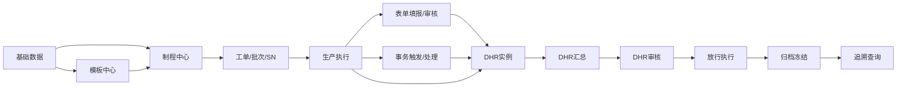

# eDHR 0-1 产品化功能矩阵与业务闭环设计规格

日期：2026-06-05  
状态：评审稿  
适用范围：商业级 ToB eDHR 新产品 0-1 模块划分、功能矩阵、P0 闭环设计与后续拆解依据

## 1. 结论摘要

冠骋的 eDHR 可以作为医疗器械 eDHR / 轻 MES 业务参考，但不能作为产品结构照搬。它有价值的不是低代码平台本身，而是把“制程配置 + 表单模板 + 事务流程 + 生产执行 + DHR 汇总 + 放行 + 追溯”串成了可落地的生产记录闭环。

我们的产品不应绑定单一行业，但首个商业化目标可以以医疗器械 eDHR 为主要验证场景。通用性不来自“无限低代码”，而来自以下可控配置能力：

- 基础主数据可扩展：工厂、车间、产线、产品、产品族、设备、SOP、工序、原因等。
- 模板可扩展：表单模板、DHR 模板、放行单模板、流转单模板。
- 制程可扩展：产品/产品族 + 生产模式 + 工艺路线 + DHR 模板 + 放行单 + 工序表单/SOP/权限。
- 事务可扩展：全局/按需事务、事务流程、事务节点、事务触发范围。
- 流程可扩展：表单流程、DHR 汇总审核流程、模板审批流程、变更审核流程、放行流程。

P0 不做“大而全系统”，而是先跑通这一条闭环：

```text
基础建模
-> 表单/DHR/放行模板
-> 工序/工艺路线/制程配置
-> 工单创建或同步
-> 工单批次拆分
-> 批次生产执行
-> 工序表单填报与表单审核
-> 工序事务触发与处理
-> DHR 自动聚合与人工补充整理
-> DHR 汇总审核
-> 放行单填报与放行审核
-> 归档冻结
-> DHR/表单/生产追溯
```

## 2. 资料优先级

本设计的业务依据按优先级排序：

| 优先级 | 资料 | 用途 |
| --- | --- | --- |
| 1 | `edhr探索之旅.docx` | 反推真实菜单、操作动作、业务闭环、事务/表单/DHR/放行逻辑 |
| 1 | `edhr生产业务.png` | 校准基础数据、生产阶段、放行阶段三段主线 |
| 1 | 冠骋在线 eDHR 页面观察 | 校准 live 菜单、字段、按钮、状态、列表结构 |
| 2 | 冠骋前端源码片段 | 反推事务配置、制程配置、工作台事务、执行节点的数据结构 |
| 3 | 现有 MVP/商用 PRD | 仅作为合规底座、技术边界、电子记录要求参考，不作为业务功能矩阵主依据 |

## 3. 产品边界

### 3.1 我们要做什么

我们要做的是可产品化、可定制、可私有化交付的 eDHR 系统。它的核心对象不是“任意低代码模型”，而是生产质量证据链：

```text
产品/制程配置
-> 批次/SN/工单
-> 工序执行记录
-> 事务记录
-> 检验/返工/异常/附录记录
-> DHR 目录与证据聚合
-> 审核与放行
-> 冻结归档
-> 追溯查询
```

### 3.2 我们不照搬什么

| 冠骋能力 | 我们的取舍 |
| --- | --- |
| Excel 式自由表单设计器 | 不照搬。P0 做结构化字段/表格/附件/签名块/审核块，P1 做 AI 辅助还原草稿。 |
| 大而全低代码模型平台 | 不照搬。只抽象 eDHR 需要的受控模板、表单实例、事务实例、DHR 证据。 |
| 全量 MES/WMS/QMS/LIMS/DMS | 不在 P0 做完整替代。只做 eDHR 所需引用、挂接、导入或轻量接口。 |
| 任意复杂 BPMN | 不在 P0 做完整 BPMN。先做可配置节点、条件、并行、审核、消息、事务嵌套。 |
| 设备互联/OCR/报表设计器全能力 | P2 扩展。P0 保留结构和接口边界。 |

## 4. 端到端业务闭环



业务流程图里的三段可落成如下：

| 阶段 | 业务含义 | 关键模块 |
| --- | --- | --- |
| 基础数据 | 产品、表单模板、DHR 模板、工序、工艺路线、事务先建好，再进入制程配置 | 主数据、模板中心、制程中心、事务中心 |
| 生产阶段 | 工单创建或 ERP 同步后拆分批次/SN，按制程开始生产，按工序填表，特殊情况触发事务 | 工单管理、批次/SN、生产执行、表单实例、事务实例 |
| 放行阶段 | 已完成 DHR 进入汇总，按模板整理证据，审核后生成/填写放行单，审核完成后归档 | DHR 汇总、DHR 审核、放行执行、归档、追溯 |

## 5. 功能矩阵

优先级定义：

- P0：首个商业可演示闭环必须具备；缺失会导致 DHR 从配置到放行无法闭环。
- P1：产品化增强；不影响首个闭环，但影响实施效率、客户适配和专业度。
- P2：高级扩展；面向复杂行业、深度集成、AI 增强或设备自动化。

### 5.1 合规可信基座

| 功能 | P0/P1/P2 | 说明 |
| --- | --- | --- |
| 租户/工厂/组织/部门/岗位 | P0 | 支撑多工厂、权限范围、审核组织配置。 |
| 用户、角色、权限 | P0 | 页面权限、操作权限、数据范围、审核/签名/放行权限。 |
| 审计追踪 | P0 | 新增、修改、删除、状态流转、签名、导出、接口调用、流程干预都要留痕。 |
| 电子签名 | P0 | 表单提交/审核、DHR 汇总审核、变更、放行等高风险动作需要签名能力。 |
| 受控状态机 | P0 | 模板、表单实例、事务实例、DHR、放行单、变更单都必须有状态约束。 |
| 文件与附件存储 | P0 | 表单附件、图片、DHR 导出包、放行单、SOP 引用。 |
| 编码规则 | P0 | 事务编码、表单流水号、DHR 编号、批次/SN 可配置规则。 |
| 通知消息 | P1 | 表单审核、事务任务、DHR 审核、变更审核、消息节点。 |
| 流程日志/流程干预 | P1 | 转办、撤回、流程日志，P0 可先保留审计与后台能力。 |
| CSV/CSA 支持资料 | P1 | 系统说明、权限矩阵、审计追踪说明、测试脚本模板。 |

### 5.2 工作台

| 功能 | P0/P1/P2 | 说明 |
| --- | --- | --- |
| 我的事务 | P0 | 生产事务、批次事务、SN 事务、检验/放行事务待办入口。 |
| 表单审核待办 | P0 | 表单流程里的审核、退回、转办。 |
| DHR/放行/变更待办 | P1 | 可先在各业务列表处理，后续聚合到统一工作台。 |
| 业务数据卡片 | P1 | 今日报工、良品、不良、工时等。 |
| 我的常用 | P2 | 个性化菜单快捷入口。 |

### 5.3 基础建模

| 功能 | P0/P1/P2 | 说明 |
| --- | --- | --- |
| 工厂/车间/产线 | P0 | 不绑定行业，所有生产执行与权限范围都需要。 |
| 产品家族/产品/产品版本 | P0 | 制程配置、DHR 模板匹配、放行单生成的核心基础。 |
| 物料/部件主数据 | P1 | P0 先用结构化追溯字段记录关键物料/部件批号，P1 再独立建物料主数据。 |
| BOM/关键物料清单引用 | P1 | 支撑关键物料消耗、物料平衡和 ERP/BOM 对照。 |
| 单位 | P0 | 工单数量、报工、检验、物料使用。 |
| SOP 文档引用 | P0 | 生产执行和检验执行页面显示受控作业指导书。 |
| 设备类型/设备列表 | P0 | 表单追溯、设备使用记录、设备互联扩展的基础。 |
| 工序 | P0 | 工艺路线和制程配置的基础节点。 |
| 原因建模：不良/报废分类与原因 | P1 | 支撑不良处置、报废、返工事务。P0 可先做原因字典。 |
| 人员资质/培训引用 | P1 | 医疗器械场景重要，但首个闭环可先通过角色权限约束。 |
| 建模追溯 | P1 | 主数据变更历史与引用影响。P0 用审计追踪覆盖。 |
| 批量导入/导出 | P1 | 实施效率能力，P0 可先支持最关键的产品、工序、工单导入。 |

### 5.4 模板中心

| 功能 | P0/P1/P2 | 说明 |
| --- | --- | --- |
| 表单分类/表单模板 | P0 | 结构化表单模板，而非 Excel 级自由画布。 |
| 字段组件 | P0 | 文本、数字、日期、枚举、人员/部门、批次/SN、产品、设备、工单、附件、图片。 |
| 表格组件 | P0 | 固定表、动态表、主子表联动校验。 |
| 签名块/复核块/审核块 | P0 | 电子记录与流程审核的关键。 |
| 表单校验规则 | P0 | 必填、格式、范围、逻辑公式、主子表合计。 |
| 表单流程 | P0 | 提交、审核、退回、转办、并行审核、字段权限。 |
| 字段级流程权限 | P0 | 每个审核节点配置字段编辑/只读/隐藏。 |
| 模板版本控制 | P0 | 草稿、审批中、已发布、停用/作废，实例绑定版本。 |
| 模板审批 | P0 | 表单模板、DHR 模板、放行模板发布前审批。 |
| DHR 模板 | P0 | 目录、必需表单、可选表单、证据类型、排序。 |
| 放行单模板 | P0 | 与制程配置绑定，DHR 已汇总后可自动生成放行单。 |
| 流转单模板 | P1 | 批次/SN 生产流转单打印。 |
| 标签参数/标签模板 | P1 | 支持标签/UDI/包装确认和打印映射；P0 只保留表单字段记录。 |
| 版本对比 | P1 | 字段新增/删除、校验、签名格式、权限差异。 |
| 记录本模板 | P1 | 非标准生产记录、周期性记录或补充记录。 |
| AI 表单还原 | P1 | Word/Excel/PDF/图片识别为模板草稿，人工确认后才能发布。 |
| Excel 样式还原 | P2 | 只做导入辅助，不把产品变成 Excel 设计器。 |

### 5.5 制程中心

| 功能 | P0/P1/P2 | 说明 |
| --- | --- | --- |
| 工艺路线 | P0 | 工序节点、顺序、版本、复制、版本复制。 |
| 制程配置 | P0 | 产品/产品族 + 产品版本 + 生产模式 + 工艺路线 + DHR 模板 + 放行单。 |
| 工序表单绑定 | P0 | 每道工序配置待填表单、必填标识、排序。 |
| 工序 SOP 绑定 | P0 | 执行页面展示当前工序 SOP。 |
| 工序表单权限 | P0 | 配置填报权限、字段编辑权限。 |
| 事务显隐规则 | P0 | 制程/事务配置共同决定生产执行页看到哪些事务。 |
| 连续生产模式 | P1 | 部分结束、工序可切换、批量堆积场景。 |
| 并行/返工路线 | P1 | 复杂工艺和返工执行。 |
| 工艺/制程审核 | P1 | P0 可先做模板发布审批，P1 补齐工艺审和制程审。 |

### 5.6 事务中心

| 功能 | P0/P1/P2 | 说明 |
| --- | --- | --- |
| 事务列表 | P0 | 名称、编码、描述、来源、作用范围、状态、版本。 |
| 作用范围 | P0 | 全局：所有生产/返工工序可见；按需：需在事务配置里绑定产品/工序。 |
| 事务流程配置 | P0 | 保存草稿、发布版本、复制版本。 |
| 表单节点 | P0 | 事务执行时触发表单填报。 |
| 条件分支 | P0 | 从左到右命中第一条路径，如不良处理意见决定返工/报废/无需处理。 |
| 条件并行 | P1 | 多个条件同时满足时并行执行。 |
| 事务节点 | P1 | 子事务嵌套，P0 可保留模型和最小运行骨架。 |
| 配置节点 | P1 | 返工配置、批次转 SN/拆分配置。 |
| 消息通知节点 | P1 | 站内、企微、钉钉、飞书、邮箱。 |
| 事务配置 | P0 | 个性化、例外、按产品家族/产品/工序/生产或返工场景配置。 |
| 事务实例 | P0 | 创建、处理、结束、状态流转、关联批次/SN/工序。 |
| 内置事务模板 | P0 | 报工、不良处置、报废、返工、物料消耗/物料报废先以模板提供。 |
| 我的事务 | P0 | 工作台处理入口。 |

### 5.7 生产执行

| 功能 | P0/P1/P2 | 说明 |
| --- | --- | --- |
| 工单管理 | P0 | 手动创建、导入/API 同步、结束。 |
| 工单拆分 | P0 | 批次拆分；SN 拆分先做基础能力。 |
| 批次管理 | P0 | 查看 DHR、执行详情、结束、打印流转单。 |
| SN 管理 | P1 | P0 保留数据模型和查询，首个闭环优先跑批次。 |
| 批次生产执行 | P0 | 选择/扫码批次、开始、结束、查看 SOP/路线、工序流转。 |
| 工序待填表单 | P0 | 按制程配置生成，必须填完才能结束工序。 |
| 表单填报/提交/审核 | P0 | 可从生产执行、DHR 填报、事务、附录进入。 |
| 附录表单 | P0 | 创建新表单或绑定已有表单，汇总时可补入 DHR。 |
| 关键物料/部件追溯记录 | P0 | 通过表单追溯字段记录物料批号、部件 SN、设备、工单等。 |
| 工序事务 | P0 | 在生产/返工执行页触发不良、报工、返工等事务。 |
| 返工执行 | P1 | P0 先实现事务触发和返工任务骨架；完整返工路线 P1。 |
| 批次事务/SN 事务列表 | P0 | 支持新建、处理、结束、查询。 |
| 报工数据 | P1 | P0 可通过表单字段沉淀，P1 做统计模型和 ERP 推送。 |
| 领料/补料/退料单据挂接 | P1 | 外部 ERP/WMS 单据可作为表单或附件进入 DHR 证据。 |
| 物料消耗/物料平衡 | P1 | 先做关键物料使用，复杂平衡和仓储事务后置。 |
| 生产入库 | P2 | 属于 ERP/WMS/MES 边界，P0 不做库存事务。 |
| 连续生产部分结束 | P1 | 大批量流转场景。 |

### 5.8 检验管理

| 功能 | P0/P1/P2 | 说明 |
| --- | --- | --- |
| 检验记录作为表单 | P0 | P0 先让检验记录通过生产工序表单或 DHR 表单进入证据链。 |
| 检验执行 | P1 | 独立检验作业、检验任务、检验流水号。 |
| 检验事务 | P1 | 检验场景下的事务列表、事务配置、子事务。 |
| 检验规程 | P1 | 产品/产品族 + SOP + 表单排序。 |
| LIMS 接口 | P2 | 检验结果、报告、证书导入或挂接。 |

### 5.9 DHR 与记录管理

| 功能 | P0/P1/P2 | 说明 |
| --- | --- | --- |
| DHR 实例自动生成 | P0 | 批次开始生产时按制程/DHR 模板生成 DHR。 |
| 记录类型 | P0 | 支持批次、SN、手动创建等类型；原材料 DHR 可作为 P1 场景增强。 |
| DHR 填报 | P0 | 输入批次/SN，自动进入已有 DHR；没有则按产品/模板创建。 |
| DHR 状态 | P0 | 未填报、进行中、已完成、汇总中/审核中、已汇总、已放行、已归档。 |
| 表单列表 | P0 | 查询 DHR、表单填报、事务、返工、附录中的全部表单实例。 |
| 表单审核 | P0 | 我的待办、我的已办、审核/退回/转办。 |
| DHR 列表 | P0 | 全部 DHR 查询、详情、状态跟踪。 |
| DHR 汇总 | P0 | 待汇总/已汇总；按 DHR 模板自动聚合，允许从附录/事务/返工/记录本补充。 |
| DHR 审核 | P0 | 汇总后可选择流程审核或直接汇总。 |
| DHR 详情 | P0 | 目录、表单实例、事务/返工/附录来源、状态、签名、审计。 |
| 记录本 | P1 | 发布、填报、完成、标签、汇总补充来源。 |
| 原材料 DHR | P1 | 支持原材料入厂、检验、可用状态等证据链，复用 DHR 模板和填报能力。 |
| 打印/导出 | P1 | 表单、DHR、记录本、DHR 模板打包下载。 |

### 5.10 放行管理

| 功能 | P0/P1/P2 | 说明 |
| --- | --- | --- |
| 放行执行 | P0 | 输入/扫码批次或 SN，自动查找或创建放行单。 |
| 放行单自动创建 | P0 | DHR 已汇总后，按制程配置里的放行单模板生成。 |
| 放行单填报 | P0 | 本质是受控表单实例，带审核/签名。 |
| 放行列表 | P0 | 未放行、放行中、已放行查询与处理。 |
| 单批次/SN 放行 | P0 | 一张放行单对应一个批次或一个 SN。 |
| SN 合并放行 | P1 | 多个同产品版本 SN 合并放行。 |
| 放行事务 | P1 | 放行流程里用事务节点/放行节点处理。 |
| 放行规程 | P1 | 按产品/产品族配置放行 SOP、表单、事务和排序。 |
| 放行后冻结/归档 | P0 | 放行完成后 DHR 证据冻结，后续只能走受控变更。 |
| 放行追溯 | P1 | 按放行单、批次/SN、产品查询放行证据。 |

### 5.11 变更管理

| 功能 | P0/P1/P2 | 说明 |
| --- | --- | --- |
| 表单变更 | P0 | 按表单流水号查询，输入变更原因，提交变更，审核后生效。 |
| DHR 变更 | P0 | 在 DHR 目录中选择表单进行变更。 |
| 双人签名 | P0 | 变更提交人和审核人签名确认。 |
| 变更审核 | P0 | 我的待办、处理、详情、退回。 |
| 变更记录/批注 | P1 | 标红字段、查看前后差异。 |
| 记录本变更 | P1 | 记录本中的表单变更。 |
| 放行后更正 | P1 | 放行/归档后的受控补正、签名失效和重新审核。 |

### 5.12 追溯与报表

| 功能 | P0/P1/P2 | 说明 |
| --- | --- | --- |
| 追溯字段 | P0 | LOT/SN、物料、设备、工单号、记录单号、追溯日期等字段类型。 |
| DHR 追溯 | P0 | 正向：按 DHR 信息；反向：按 DHR 表单中的追溯字段。 |
| 表单追溯 | P0 | 正向：表单流水号/模板/状态；反向：表单追溯字段。 |
| 生产追溯 | P1 | 工单、拆批、执行、事务触发、表单填报按时间线展示。 |
| 放行追溯 | P1 | 放行证据查询。 |
| 报工/报废记录 | P1 | 从表单字段抽取统计模型。 |
| 自定义报表设计器 | P2 | 不作为 eDHR P0 核心。 |

### 5.13 物料、仓储、标签与打印边界

| 功能 | P0/P1/P2 | 说明 |
| --- | --- | --- |
| 关键物料追溯字段 | P0 | 满足首个 DHR 闭环的物料批号、部件 SN、用量、设备等记录。 |
| 物料主数据 | P1 | 与 ERP/PLM 同步，支撑产品、原材料、半成品、关键部件。 |
| 领料/补料/退料单挂接 | P1 | 作为 DHR 附属证据或表单实例，不做库存过账。 |
| 物料消耗事务 | P1 | 可作为事务中心的内置事务模板。 |
| 仓储入库/出库/仓储事务 | P2 | 完整 WMS 能力，不进入 eDHR P0。 |
| 标签参数/标签模板 | P1 | 支持标签字段、打印参数、标签核对记录。 |
| Bartender/外部标签软件映射 | P2 | 具体打印软件集成后置。 |
| 记录打印任务 | P1 | 表单、DHR、记录本、DHR 模板导出打包下载。 |

### 5.14 集成与 AI 扩展

| 功能 | P0/P1/P2 | 说明 |
| --- | --- | --- |
| 手动导入 | P0 | 工单、产品、工序等关键导入。 |
| Open API | P1 | 工单、产品、SOP、设备、工艺路线、DHR/放行状态。 |
| 连接器/连接流 | P2 | 类 iPaaS 能力，复杂度高，后续做。 |
| ERP 工单同步 | P1 | 标准接口优先。 |
| DMS SOP 同步 | P1 | SOP 受控版本引用。 |
| 设备互联 | P2 | MQTT/IPaaS 自动填表。 |
| OCR 识别填表 | P2 | 纸质报告、铭牌、仪表读数识别为草稿。 |
| AI 表单还原 | P1 | AI 生成模板草稿，人工确认、审批、发布。 |
| AI 证据检查 | P2 | 检查缺项、异常、模板不一致，只做建议，不替代质量判断。 |

## 6. 哪些可以直接参考建模

这些模块可以直接从最新资料和冠骋反推进入 0-1 建模：

| 模块 | 可直接参考的原因 | 建议 |
| --- | --- | --- |
| 工厂/车间/产线 | 行业无关，是生产组织基础 | P0 建模 |
| 产品家族/产品/产品版本 | 制程、DHR、放行单都依赖 | P0 建模 |
| 设备类型/设备 | 表单追溯和生产记录常用 | P0 建模 |
| SOP 文档引用 | 生产执行页需要展示 | P0 建模，不做完整 DMS |
| 工序/工艺路线 | 制程执行核心 | P0 建模 |
| 表单模板 | 所有记录证据来源 | P0 建模，但不用 Excel 式设计器 |
| DHR 模板 | 汇总目录和必需证据来源 | P0 建模 |
| 放行单模板 | 放行执行自动生成依据 | P0 建模 |
| 制程配置 | 连接产品、路线、DHR、放行、表单、SOP | P0 建模 |
| 事务定义/事务配置 | 生产执行异常和补充动作核心 | P0 建模 |
| 工单/批次 | 首个闭环必须 | P0 建模 |
| 表单实例/DHR 实例/事务实例 | 执行闭环核心 | P0 建模 |
| 审核流程/表单流程 | 表单、DHR、变更都依赖 | P0 建模 |
| 审计追踪/电子签名 | 受控记录底座 | P0 建模 |

## 7. 现在就可以开始的 0-1 P0 范围

第一阶段建议只做“批次生产闭环”，SN 先保留模型和轻量入口，避免 P0 被复杂生产形态拖大。

P0 必须完成：

1. 合规底座：用户、角色、权限、审计追踪、电子签名、附件、编码规则。
2. 基础建模：工厂/车间/产线、产品家族/产品、单位、设备、SOP、工序。
3. 模板中心：结构化表单模板、表单流程、DHR 模板、放行单模板、模板版本与审批。
4. 制程中心：工艺路线、制程配置、工序表单/SOP/权限绑定。
5. 事务中心：事务定义、全局/按需、事务流程表单节点、条件分支、事务实例、生产执行页触发。
6. 生产执行：工单创建/导入、批次拆分、批次执行、工序开始/结束、待填表单、附录、事务处理。
7. DHR：自动生成实例、填报、列表、汇总、审核、详情。
8. 放行：放行单生成、放行填报、放行审核、冻结。
9. 变更：表单/DHR 变更、原因、双人签名、变更审核。
10. 追溯：DHR 正反向、表单正反向、基础生产时间线。

## 8. 需要继续推敲的模块

| 模块 | 为什么要推敲 | 建议决策点 |
| --- | --- | --- |
| SN 生产深度 | SN 与批次混合、SN 合并放行、批次转 SN 都会扩大状态机 | P0 是否只做模型和查询，P1 做完整执行 |
| 连续生产 | 部分结束和多工序并行会影响工序状态模型 | P1 做，P0 先留开关字段 |
| 完整检验管理 | 检验执行、检验事务、检验规程接近独立子系统 | P0 用表单承载检验记录，P1 独立检验作业 |
| 完整返工/返修 | 返工路线、返工数量、复检、风险评估复杂 | P0 做事务触发和返工任务骨架，P1 深化 |
| 物料/WMS | 物料消耗、平衡、领退补料易膨胀成 WMS | P0 只记录关键物料追溯字段，P1 再做物料事务 |
| 放行事务 vs 放行表单 | 冠骋支持放行单和放行事务两套入口 | P0 先以放行单为主，事务节点做 P1 |
| 记录本 | 可补充 DHR，但不是首条生产闭环必需 | P1 做 |
| AI 表单还原 | 很有价值，但需要样本、校验、人工确认链路 | P1 开始，P0 先把结构化模板模型设计好 |
| 设备互联/OCR | 依赖现场设备、协议、摄像头、客户数据 | P2 做扩展接口 |
| 连接器/连接流 | 复杂 iPaaS 能力，容易偏离 eDHR | P1 先做标准 OpenAPI，P2 再考虑可视化连接流 |

## 9. 核心对象模型

P0 数据建模建议：

```text
Identity:
Tenant, Site, Workshop, ProductionLine, Department, User, Role, Permission

Compliance:
AuditEvent, Signature, FileObject, ControlledReason, NumberingRule

MasterData:
ProductFamily, Product, ProductVersion, Unit, SopDocument, EquipmentType, Equipment

Template:
FormTemplate, FormTemplateVersion, FormSection, FormField, FormTable,
FormSignatureBlock, FormReviewBlock, FormValidationRule,
FormWorkflowDefinition, FormWorkflowNode, FieldPermissionPolicy,
DhrTemplate, DhrTemplateVersion, DhrDirectory, DhrTemplateItem,
ReleaseFormTemplate, TravelerTemplate

Process:
Operation, Route, RouteVersion, RouteOperation,
ProcessDefinition, ProcessVersion, ProcessOperationBinding,
ProcessFormBinding, ProcessSopBinding, ProcessTransactionRule

Transaction:
TxnDefinition, TxnVersion, TxnNode, TxnEdge, TxnScopeRule,
TxnInstance, TxnTask, TxnFormBinding

Production:
WorkOrder, WorkOrderSplitPlan, Batch, SerialNumber,
ProductionExecution, OperationExecution, AppendixRecord,
ProductionReport, ReworkTask

Record:
FormInstance, FormFieldValue, FormAuditTask,
FormChangeRequest, ChangeReviewTask

DHR:
DhrInstance, DhrEvidenceItem, DhrSummaryTask, DhrReviewTask

Release:
ReleaseOrder, ReleaseFormInstance, ReleaseDecision, ArchivePackage

Trace:
TraceFieldIndex, TraceEvent, PrintJob, ImportJob
```

## 10. 核心状态机

### 10.1 模板状态

```text
DRAFT -> IN_REVIEW -> EFFECTIVE -> OBSOLETE
IN_REVIEW -> RETURNED -> DRAFT
DRAFT -> VOIDED
```

规则：

- 已生效版本不可直接修改。
- 实例必须绑定模板版本。
- 新版本不自动改写历史实例。

### 10.2 表单实例状态

```text
OPEN -> SUBMITTED -> IN_REVIEW -> COMPLETED
IN_REVIEW -> RETURNED -> OPEN
COMPLETED -> CHANGE_PENDING -> COMPLETED
OPEN -> VOIDED
```

规则：

- 流程表单提交后按表单流程创建审核任务。
- 非流程表单可提交后直接完成。
- 完成后只能走受控变更。

### 10.3 事务实例状态

```text
CREATED -> RUNNING -> WAITING_TASK -> COMPLETED
RUNNING -> ENDED
WAITING_TASK -> RETURNED -> RUNNING
```

规则：

- 事务实例必须关联批次/SN、工序、来源事务版本。
- 事务处理过程产生的表单实例、返工任务、消息均作为 DHR 候选证据。
- 结束事务必须填写原因并留审计。

### 10.4 批次执行状态

```text
NOT_STARTED -> IN_PROGRESS -> COMPLETED
IN_PROGRESS -> ENDED
```

工序状态：

```text
WAITING -> IN_PROGRESS -> COMPLETED
IN_PROGRESS -> PARTIAL_COMPLETED
```

P0 可先不实现 `PARTIAL_COMPLETED`，但模型预留。

### 10.5 DHR 状态

```text
NOT_FILLED -> IN_PROGRESS -> COMPLETED -> SUMMARY_IN_PROGRESS -> SUMMARIZED
SUMMARY_IN_PROGRESS -> RETURNED -> COMPLETED
SUMMARIZED -> RELEASE_PENDING -> RELEASED -> ARCHIVED
RELEASED -> CHANGE_PENDING -> RELEASED
```

说明：

- `COMPLETED` 表示生产/DHR 填报完成，可以进入待汇总。
- `SUMMARY_IN_PROGRESS` 对应汇总审核中。
- `SUMMARIZED` 后才可进入放行。

### 10.6 放行状态

```text
NOT_RELEASED -> RELEASE_IN_PROGRESS -> RELEASED
RELEASE_IN_PROGRESS -> RETURNED -> RELEASE_IN_PROGRESS
RELEASED -> ARCHIVED
```

### 10.7 变更状态

```text
DRAFT -> SUBMITTED -> IN_REVIEW -> APPROVED -> APPLIED
IN_REVIEW -> RETURNED -> DRAFT
SUBMITTED -> CANCELLED
```

## 11. 关键业务规则

### 11.1 制程配置规则

制程配置是 P0 的核心，不只是“工艺路线绑定表单”。

制程版本至少要定义：

- 适用范围：产品家族或产品。
- 产品版本和生产模式：批次、SN、批次转 SN 等。
- 工艺路线版本。
- DHR 模板版本。
- 放行单模板版本。
- 每个工序的 SOP。
- 每个工序的待填表单、必填标识、排序。
- 每个工序表单的填报权限、字段编辑权限。
- 每个工序可见事务：来自全局事务、按需事务、例外剔除规则。

### 11.2 表单流程规则

表单流程不是模板审批流程，也不是事务流程。它控制“表单实例填完后由谁审、审什么字段”。

P0 支持：

- 开始、审批、并行、结束。
- 审核人配置：用户、角色、部门、组织。
- 节点字段权限：编辑、只读、隐藏。
- 审核、退回、转办。
- 流程日志和审计追踪。

P0 不做：

- 任意脚本节点。
- 无限复杂 BPMN 网关。

### 11.3 事务流程规则

事务是生产执行过站时处理特殊动作的核心引擎。

P0 支持：

- 表单节点。
- 条件分支。
- 事务实例处理。
- 全局/按需作用范围。
- 生产/返工场景区分。
- 产品家族、产品、工序条件。

P1 支持：

- 条件并行。
- 子事务节点。
- 配置节点：返工配置、拆分配置。
- 消息通知节点。

### 11.4 DHR 汇总规则

DHR 汇总不是从空目录完全手工拖拽。正确理解应是：

1. DHR 模板定义目录结构和必需表单。
2. 制程执行过程中生成表单实例、事务表单、返工表单、附录表单、记录本表单。
3. 当批次/SN 执行完成且 DHR 状态为已完成，进入待汇总。
4. 汇总页面按 DHR 模板自动聚合必需表单。
5. 用户可从附录、事务、返工、记录本候选证据中补充拖入目录，也可删除不应进入归档目录的补充项。
6. 提交时可选择汇总审核流程，也可直接汇总。
7. 审核通过后 DHR 状态变为已汇总，进入放行前置状态。

P0 完整性检查至少包括：

- 必需目录是否存在。
- 必需表单是否完成。
- 表单流程是否完成。
- 事务流程是否完成或已受控结束。
- 必填字段是否通过校验。
- 签名/审核是否完成。
- 变更是否已关闭。

### 11.5 放行规则

放行以放行单为 P0 主入口：

1. DHR 已汇总后才允许放行。
2. 放行执行输入批次/SN。
3. 系统检查是否已有放行单。
4. 没有则按制程配置中的放行单模板自动创建。
5. 有则直接进入填报或查看。
6. 放行单提交后走审核/签名。
7. 放行完成后冻结 DHR 证据，后续更正必须走变更。

P1 再支持：

- 放行事务。
- SN 合并放行。
- 条件放行、紧急放行。

### 11.6 追溯规则

追溯不是简单报表，它依赖表单中的追溯字段和生产执行事件。

P0 追溯索引来源：

- 批次/SN。
- 产品/产品版本。
- 工单号。
- 工序。
- 表单流水号。
- 设备。
- 记录单号。
- 追溯日期。
- 事务实例。
- DHR 实例。
- 放行单。

P0 查询：

- DHR 正向/反向追溯。
- 表单正向/反向追溯。
- 批次生产时间线。

## 12. 表单设计器策略

P0 不做 Excel 式设计器，原因是：

- 难以保证字段语义、流程权限、审计追踪和结构化追溯。
- 实施容易变成“画表格外包”，产品复用差。
- AI 还原也需要结构化落点，而不是像素级复刻。

P0 做结构化模板设计：

| 组件 | 用途 |
| --- | --- |
| 章节 | 表单分区、标题、说明 |
| 字段 | 文本、数字、日期、枚举、人员、部门、产品、设备、批次/SN |
| 表格 | 固定表、动态表、主子表 |
| 附件/图片 | 报告、照片、证明文件 |
| 条码/扫码字段 | 批次、SN、设备、物料、工单 |
| 签名块 | 操作签名、复核签名、质量签名 |
| 审核块 | 流程节点意见、结论、退回原因 |
| 校验规则 | 必填、格式、范围、公式、主子表联动 |
| 追溯字段 | 建立正反向追溯索引 |

P1 做 AI 辅助还原：

```text
上传 Word/Excel/PDF/图片
-> AI 识别表头、字段、表格、签名、审核区域
-> 生成结构化模板草稿
-> 人工调整字段/规则/流程
-> 模板审批
-> 发布受控版本
```

AI 不允许：

- 直接发布模板。
- 静默修改已生效模板。
- 修改正式表单实例。
- 做最终放行判断。

## 13. 前端模块建议

P0 前端模块按业务闭环组织：

```text
dashboard        工作台、待办、我的事务、表单审核
master-data      工厂、车间、产线、产品、设备、SOP、工序、原因
template-center  表单模板、DHR模板、放行单模板、表单流程、模板审批
process-center   工艺路线、制程配置
txn-center       事务列表、事务流程配置、事务配置、事务实例
production       工单、批次、SN、批次执行、返工执行、批次事务
record-center    表单填报、表单审核、表单列表、DHR填报、DHR列表
dhr-summary      DHR汇总、DHR审核、DHR详情
release          放行执行、放行列表
change-control   表单变更、DHR变更、变更审核、变更列表
traceability     DHR追溯、表单追溯、生产追溯
system           用户、角色、权限、审计、编码规则、导入导出
```

交互原则：

- ToB 生产质量系统，以表格、筛选、详情、抽屉、步骤条、状态标签为主。
- 不做营销式首页。
- 高风险动作要二次确认、原因、签名、审计。
- 生产执行页要适合扫码、少输入、快速定位当前工序/待填表单/事务。
- DHR 汇总页要突出目录树、证据候选区、完整性检查、审核提交。

## 14. 阶段拆解建议

### Phase 0：可信底座与基础对象

目标：先让受控记录和状态机成立。

范围：

- 用户/角色/权限。
- 审计追踪。
- 电子签名。
- 文件附件。
- 基础主数据。
- 表单模板版本。
- 表单实例。
- DHR 模板和 DHR 实例。

### Phase 1：批次生产闭环

目标：跑通一条批次 eDHR。

范围：

- 工艺路线。
- 制程配置。
- 工单/批次拆分。
- 批次生产执行。
- 工序表单填报。
- 表单流程审核。
- DHR 汇总和审核。
- 放行单填报和放行。
- DHR/表单追溯。

### Phase 2：事务驱动异常闭环

目标：让生产特殊情况可配置、可处理、可进入 DHR。

范围：

- 事务定义。
- 事务流程表单节点和条件分支。
- 全局/按需事务配置。
- 事务实例处理。
- 报工事务。
- 不良处置事务。
- 返工任务骨架。

### Phase 3：产品化增强

目标：提升行业适配和实施效率。

范围：

- SN 执行。
- 返工执行。
- 连续生产。
- 检验管理。
- 记录本。
- 模板版本对比。
- 打印/导出。
- 标准接口。

### Phase 4：AI 与高级集成

目标：提高定制效率和自动化能力。

范围：

- AI 表单还原。
- AI DHR 证据检查。
- OCR 填表。
- 设备互联。
- 连接器/连接流。
- 自定义报表。

## 15. 对照复核

### 15.1 对照业务流程图

| 流程图节点 | 文档覆盖 |
| --- | --- |
| 产品列表 | 基础建模：产品家族/产品/版本 |
| 表单模板 | 模板中心：结构化表单模板 |
| DHR 模板 | 模板中心：DHR 模板、目录、必需表单 |
| 工序建模 | 基础建模：工序 |
| 工艺路线 | 制程中心：工艺路线 |
| 事务列表 | 事务中心：事务定义 |
| 事务配置 | 事务中心：全局/按需、个性化/例外 |
| 制程配置 | 制程中心：产品/路线/DHR/放行/表单/SOP/事务 |
| 自建或同步 ERP 工单 | 生产执行：工单管理；集成：ERP 工单同步 |
| 工单批次拆分 | 生产执行：批次拆分 |
| 开始生产 | 生产执行：批次生产执行 |
| 按工序填报工序表单 | 生产执行 + 表单流程 |
| 特殊情况事务处理 | 事务中心 + 生产执行工序事务 |
| 完成生产 | 批次/DHR 状态完成 |
| 整理汇总批记录 | DHR 汇总 |
| 批记录审核完成创建放行任务 | DHR 审核 + 放行单自动创建 |
| 放行单填报并审核 | 放行执行 |
| 审核完成批记录归档 | 放行后冻结/归档 |

### 15.2 对照探索之旅

已覆盖：

- 工作台：我的事务、表单审核、业务数据。
- 基础建模：工厂、产品、SOP、设备、单位、工序、原因。
- 模板建模：表单模板、DHR 模板、流转单、汇总配置、变更配置、审批配置。
- 制程建模：工艺路线、制程配置、工序表单/SOP/权限。
- 事务：事务列表、事务流程、全局/按需、事务配置、批次/SN 事务。
- 生产：工单、批次、SN、生产执行、返工执行、附录、工序事务。
- DHR：DHR 填报、DHR 汇总、DHR 审核、DHR 列表。
- 放行：放行执行、放行列表、单批次/SN 放行、SN 合并放行。
- 变更：表单变更、DHR 变更、记录本变更、变更审核。
- 追溯：生产、表单、DHR、记录本、放行、报工/报废。
- 物料/标签/打印：关键物料追溯、领退补料挂接、标签参数、标签模板、记录打印。
- 扩展：接口、设备互联、OCR、表单校验、连续生产、自定义事务。

暂缓但保留边界：

- 完整检验管理。
- 完整记录本。
- 完整连接器/连接流。
- 设备互联。
- OCR。
- 自定义报表设计器。

## 16. 待确认问题

1. P0 首个闭环是否明确只以“批次生产”为主，SN 先保留模型和基础查询？
2. P0 的事务节点是否只实现表单节点 + 条件分支，返工配置/拆分配置作为 P1？
3. 放行 P0 是否只做“放行单模板 + 放行单填报/审核”，不先做放行事务？
4. 检验 P0 是否先作为表单记录进入 DHR，不单独做检验作业模块？
5. 记录本是否放到 P1，P0 只保留 DHR 汇总补充证据的接口模型？
6. AI 表单还原是否作为 P1 的第一个 AI 能力，而不是 P0 阻塞项？

## 17. 非法律声明

本文是产品设计和工程拆解文档，不构成法规、法律、质量体系或检查结论意见。对外合规宣称、电子签名法律效力、客户 CSV/CSA 验证资料和 GMP 条款适用性，需要由具备资质的法规、质量和法务人员评审。
